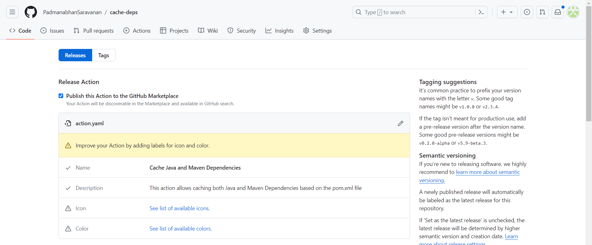
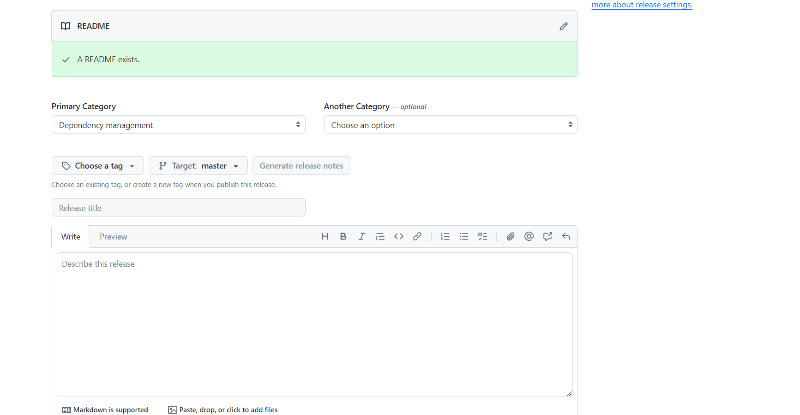

# Working with Custom Actions in GitHub Actions

GitHub Actions allows you to create custom actions, which are individual tasks that you can combine to automate your workflows. This README provides an overview of how to work with custom actions.

## About Custom Actions

Custom actions in GitHub Actions are your own tasks that interact with your repository in any way you want. You can use them to integrate with GitHub's APIs and third-party APIs. For example, you can create actions to publish npm modules, send alerts, or deploy code.

### Sharing Custom Actions

- You can create actions for your workflows or share them with the GitHub community.
- To share actions with everyone, your repository must be public.

## Types of Actions

You can build three types of actions in GitHub Actions:

1. **Composite Actions:**
    - Combine multiple workflow steps into a single action.
    - Useful for bundling multiple run commands into one action.
    - Simplify workflow configuration.
   
2. **Docker Container Actions:**
    - Package the environment with the action's code.
    - Provide a consistent and reliable unit of work.
    - Ideal for actions that require specific environment configurations.
    - Only execute on runners with a Linux operating system.

3. **JavaScript Actions:**
    - Run directly on runner machines.
    - Separate the action code from the environment.
    - Execute faster than Docker container actions.
    - Simplify the action code.

## Choosing a Location for Your Action

- For actions intended for public use, keep them in their own public repository.
- This allows versioning, tracking, and releasing the action just like any other software.
- Makes it easier for the GitHub community to discover and contribute to the action.
- For private use:
  - If the action is needed in a single repository, it can be created within that repository.
  - If the action is needed in more than one repository, it must be in its own repository with the correct access permissions.

## Release Management for Actions

- Use release management to control how you distribute updates to your actions.
- Users should specify a major version when using your action and update it only if needed.

### Using Tags for Release Management

- Create releases and tags using semantic versioning.
- Move major version tags to point to the Git ref of the current release.

### Using Branches for Release Management

- Users can reference a named branch for the action.
- Recommended for users who prefer using branch names.

### Using a Commit's SHA for Release Management

- Each Git commit has a unique SHA.
- Users can reference a commit's full SHA value.
- Useful when users want to ensure stability.

It is recommended to create a README file for your action which includes a description, input/output arguments, secrets, environment variables, and workflow examples. This makes it easier for other users to understand what the action does and how to customize it.

## Publish Custom Action to Marketplace

* Create a new public repository on GitHub.com. You can choose any repository name, or use the following `cache-deps` example.
* Clone your repository to your computer. 
* In the `cache-deps` repository, create a new file called `action.yml` and add the following example code. 

  ```yaml
  name: Cache Java and Maven Dependencies
  description: This action allows caching both Java and Maven Dependencies based on the pom.xml file
  
  inputs: 
    java-version:
      description: 'Java version to use'
      default: '11'
      required: true
    working-dir:
      description: The working directory of the application
      default: .
      required: false
  
  runs:
    using: 'composite'
    steps: 
      - name: Setup Java version ${{ inputs.java-version }}
        uses: actions/setup-java@v4
        with:
          distribution: 'adopt'
          java-version: ${{ inputs.java-version }}
          cache: 'maven'
  
      - name: Install Dependencies
        run: mvn dependency:go-offline
        shell: bash
        working-directory: ${{ inputs.working-dir }}
  ```

* From your terminal, check in your action.yml file.

  ```git
  git add action.yml
  git commit -m "Add action"
  git push
  ```

* From your terminal, add a tag. This example uses a tag called v1.

  ```git
  git tag -a -m "Description of this release" v1
  git push --follow-tags
  ```

* Create a new release:

  * Go to your repository on GitHub.
  * Click on the "Releases" tab.
  * Click on "Draft a new release".



* Mark as publish this action to the GitHub Marketplace:

  * you'll see an option to "Publish this action to the GitHub Marketplace". Check this option.

* Enable Two-Factor Authentication (2FA):

  * If you haven't already enabled Two-Factor Authentication for your GitHub account, you'll need to do so. Follow the instructions provided by GitHub to set it up.

* Select the tag and then release:

  * When creating a new release, ensure you select the appropriate tag/version that corresponds to your action's release.



* Review and confirm:

  * Review all the details of your release, ensuring everything is accurate.
  * Once satisfied, click on "Publish release".

* Verify the action on GitHub Marketplace:

  * After publishing the release, navigate to the "Marketplace" tab of your GitHub repository.
  * You should see your action listed there.
  * Users can now discover and install your action from the GitHub Marketplace.

## Testing out your action in a workflow

* Copy the workflow code into a `.github/workflows/custom-composite-actions.yml` file in another repository, but replace `repository-name/cache-deps@v1` with the repository and tag you created. 

  ```yaml
  name: 08 - Custom Actions - Composite
  run-name: 08 - Custom Actions - Composite
  
  on:
    workflow_dispatch:
  
  env:
    working-directory: ./
  
  jobs:
    build:
      runs-on: ubuntu-latest
      steps:
        - name: checkout repository
          uses: actions/checkout@v4
  
        - name: Setup Java & Maven dependencies
          uses: your-repository-name/cache-deps@v1
          with:
            java-version: 11
            working-dir: ${{ env.working-directory }}
  
        - name: Run tests
          run: mvn test
  
        - name: Build with Maven
          run: mvn clean install
  ```

* Run the workflow