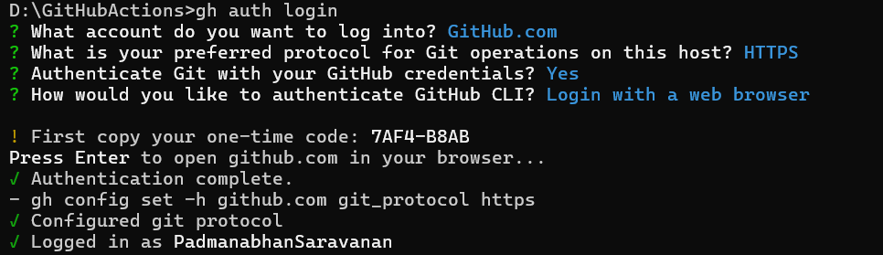

# Jenkins to Github Actions Migration 

* [**Creating Github repository with github actions enabled**](#creating-github-repository-with-github-actions-enabled) 
* [**Translate Jenkins Jobs to github action workflows**](#translate-jenkins-jobs-to-github-action-workflows)
* [**Secrets and Environment Variables**](#secrets-and-environment-variables)
* [**Testing with Github actions**](#testing-with-github-actions) 
* [**Gradual migration and retiring Jenkins**](#gradual-migration-and-retiring-jenkins)
* [**Migrating from Jenkins with GitHub Actions Importer**](#migrating-from-jenkins-with-github-actions-importer) 

## Creating Github repository with github actions enabled 

There are two options to create a GitHub repository with GitHub Actions enabled: using the GitHub CLI (`gh`) or enabling GitHub Actions through the web UI.

**Using GitHub CLI (gh)**

If you prefer using the GitHub CLI (`gh`), you can follow these steps:

**1. Install GitHub CLI (`gh`):**

* You can download and install `gh` from the GitHub CLI releases page: [GitHub CLI Releases](https://cli.github.com/).

**2. Authenticate with GitHub:**

* Run `gh auth login` and follow the prompts to authenticate with your GitHub account.

  

**3. Create a New Repository with GitHub Actions Enabled:**

* Run the following command to create a new repository with GitHub Actions enabled:

  ```gh
  gh repo create <repository_name> --enable-actions
  ```

* Replace <repository_name> with the name you want for your new repository.

**Using GitHub Web UI**

If you prefer using the GitHub web interface, you can enable GitHub Actions when creating a new repository:

**1. Navigate to GitHub:**

* Open your web browser and go to GitHub.

**2. Create a New Repository:**

* Click on the "+" icon in the top right corner and select "New repository".

**3. Fill in Repository Details:**

* Enter the repository name, description, and choose whether the repository should be public or private.

**4. Enable GitHub Actions:**

* Check the option "Initialize this repository with a README".
* Select a license if needed.
* Check the option "Add a workflow" and choose a template from the dropdown. This will enable GitHub Actions for your repository.

**5. Create Repository:**

* Click on the "Create repository" button to finalize the creation of your repository with GitHub Actions enabled.

## Translate Jenkins Jobs to github action workflows

A pipeline Jenkins job defines a series of stages and steps within each stage. To translate this to GitHub Actions:

* Identify the stages and steps defined in the Jenkins pipeline.
* Use the jobs and steps syntax in GitHub Actions to define each stage and step.

**Jenkins Pipeline Explanation:**

* **Agent**: Specifies the execution environment for the pipeline. In this case, it's set to "any", meaning the pipeline can run on any available agent.
* **Stages**: Defines the different stages of the pipeline.

  * **Build**: Runs the Maven `clean install` command to build the project.
  * **Test**: Executes Maven `test` command to run the project's unit tests.
  * **Deploy**: Runs Maven `deploy` command to deploy the built artifact.


```yaml
# Jenkins Pipeline Example
pipeline {
    agent any
    stages {
        stage('Build') {
            steps {
                sh 'mvn clean install'
            }
        }
        stage('Test') {
            steps {
                sh 'mvn test'
            }
        }
        stage('Deploy') {
            steps {
                sh 'mvn deploy'
            }
        }
    }
}
```

**Equivalent GitHub Actions Workflow Explanation:**

* Name: Specifies the name of the GitHub Actions workflow.
* On: Defines the event(s) that trigger the workflow. In this case, it triggers on push events to the main branch.
* Jobs: Defines the jobs that run within the workflow.

  * Build: Represents the build stage.
    
    * Runs-on: Specifies the type of virtual environment the job runs on. Here, it's set to ubuntu-latest.

  * Steps: Defines the sequence of steps to execute within the job.

    * Checkout code: Uses the actions/checkout action to check out the repository's code.

    * Build: Runs the Maven clean install command to build the project.

    * Test: Runs the Maven test command to execute unit tests.

    * Deploy: Executes the Maven deploy command to deploy the built artifact.

```yaml
# Equivalent GitHub Actions Workflow
name: CI/CD Pipeline

on:
  push:
    branches:
      - main

jobs:
  build:
    runs-on: ubuntu-latest
    steps:
      - name: Checkout code
        uses: actions/checkout@v2

      - name: Build
        run: mvn clean install

      - name: Test
        run: mvn test

      - name: Deploy
        run: mvn deploy
```

## Secrets and Environment Variables

**Secrets**

Secrets in GitHub Actions are encrypted environment variables that you can use to store sensitive information such as API keys, access tokens, or passwords. These secrets are encrypted and securely stored, allowing you to use them in your workflows without exposing them in your repository.

Adding Secrets to Your Repository

**1. Navigate to Repository Settings:**

* Go to your GitHub repository.
* Click on "Settings" in the top-right corner.
* Select "Secrets" from the left sidebar.

**2. Add New Secret:**

* Click on "New repository secret".
* Enter the name and value for your secret.
* Click "Add secret" to save it.

**Accessing Secrets in Workflows**

You can access secrets in your GitHub Actions workflows using the `secrets` context. For example:

```yaml
name: CI Workflow

on:
  push:
    branches:
      - main

jobs:
  build:
    runs-on: ubuntu-latest
    steps:
      - name: Checkout code
        uses: actions/checkout@v2

      - name: Use Secret
        run: echo ${{ secrets.MY_SECRET }}
```

**Environment Variables**

Environment variables in GitHub Actions are key-value pairs that you can use to pass data between steps in a workflow or customize the behavior of your workflow.

**Setting Environment Variables in Workflows**

You can set environment variables directly in your workflow YAML file using the `env` keyword. For example:

```yaml
name: CI Workflow

on:
  push:
    branches:
      - main

jobs:
  build:
    runs-on: ubuntu-latest
    env:
      MY_VARIABLE: 'my_value'
    steps:
      - name: Checkout code
        uses: actions/checkout@v2

      - name: Use Environment Variable
        run: echo $MY_VARIABLE
```

**Using Secrets as Environment Variables**

You can also use secrets as environment variables in your workflows by setting them in the `env` section of your job. For example:

```yaml
name: CI Workflow

on:
  push:
    branches:
      - main

jobs:
  build:
    runs-on: ubuntu-latest
    env:
      MY_SECRET: ${{ secrets.MY_SECRET }}
    steps:
      - name: Checkout code
        uses: actions/checkout@v2

      - name: Use Secret as Environment Variable
        run: echo $MY_SECRET
```

## Testing with Github actions 

Testing a Java application using GitHub Actions involves setting up workflows to automate the build and test processes. Below is an example of a GitHub Actions workflow for testing a Java application:

```yaml
name: Java CI

on:
  push:
    branches:
      - main
  pull_request:
    branches:
      - main

jobs:
  build:
    runs-on: ubuntu-latest

    steps:
    - name: Checkout code
      uses: actions/checkout@v2

    - name: Set up JDK 11
      uses: actions/setup-java@v2
      with:
        java-version: '11'
        distribution: 'adopt'

    - name: Build with Maven
      run: mvn -B package --file pom.xml

    - name: Run Tests
      run: mvn test
```

This workflow will trigger on every push to the `main` branch and on every pull request targeting the `main` branch. It sets up the required JDK version, builds the Java application using Maven, and then runs the tests using Maven.

## Gradual migration and retiring Jenkins

Gradual migration from Jenkins to GitHub Actions involves transitioning your CI/CD workflows, pipelines, and jobs from Jenkins to GitHub Actions over time, while ensuring minimal disruption to your development and deployment processes. Here's a step-by-step guide on how to approach gradual migration and eventually retire Jenkins:

**1. Assess Your Jenkins Setup**

 * Analyze your existing Jenkins pipelines, jobs, configurations, and dependencies.
 * Identify the critical pipelines and jobs that need to be migrated first.

**2. Set Up GitHub Actions**

Familiarize yourself with GitHub Actions and its capabilities.
Create a plan for how you'll structure your workflows in GitHub Actions.

**3. Migrate Non-Critical Jobs**

Start by migrating non-critical jobs or pipelines from Jenkins to GitHub Actions.
Rewrite the Jenkins pipelines as GitHub Actions workflows.
Test the migrated workflows thoroughly to ensure they function as expected.

**4. Run Parallel Workflows**

Run both Jenkins and GitHub Actions workflows in parallel for critical pipelines.
Compare the results of both workflows to ensure consistency.
Gradually increase the number of workflows migrated to GitHub Actions as confidence grows.

**5. Update Documentation and Processes**

Update documentation, runbooks, and internal processes to reflect the transition to GitHub Actions.
Train team members on using GitHub Actions and any new processes.

**6. Monitor and Iterate**

Monitor the performance and reliability of GitHub Actions workflows.
Gather feedback from team members and stakeholders.
Iterate on workflows based on feedback and evolving requirements.

**7. Retire Jenkins**

Once all critical pipelines and jobs have been successfully migrated to GitHub Actions and validated, plan for the retirement of Jenkins.
Inform stakeholders about the retirement plan and timeline.
Decommission Jenkins infrastructure and services after ensuring all necessary data and configurations have been migrated or backed up.

**8. Post-Migration Cleanup**

Remove any leftover Jenkins configurations, jobs, or plugins.
Update integrations, tools, and services that were dependent on Jenkins.
Perform a final review to ensure all dependencies on Jenkins have been addressed.

## Migrating from Jenkins with GitHub Actions Importer

**Prerequisites:**

1. You need a Jenkins account or organization with pipelines and jobs you want to convert.
2. Access to create a Jenkins personal API token.
3. An environment where you can run Linux-based containers with Docker and GitHub CLI installed.

* [**Installing GitHub Actions Importer CLI Extension:**](#installing-github-actions-importer-cli-extension)
* [**Perform an audit of Jenkins**](#perform-an-audit-of-jenkins)
* [**Forecast potential build runner usage**](#forecast-potential-build-runner-usage)
* [**Perform a dry run migration of a Jenkins pipeline**](#perform-a-dry-run-migration-of-a-jenkins-pipeline)
* [**Perform a production migration of a Jenkins pipeline**](#perform-a-production-migration-of-a-jenkins-pipeline)

### **Installing GitHub Actions Importer CLI Extension:**

1. Install the GitHub Actions Importer CLI extension using the command:

```gh
gh extension install github/gh-actions-importer
```

2. Verify the installation by running:

```gh
gh actions-importer -h
```

**Configuring Credentials:**

1. Create a GitHub personal access token with the workflow scope.
2. Create a Jenkins API token.
3. Run the GitHub Actions Importer configure command:

```gh
gh actions-importer configure
```

Provide the required information:

* Select Jenkins as the CI provider.
* Enter GitHub personal access token.
* Accept the default GitHub base URL.
* Enter Jenkins API token, username, and Jenkins base URL.

> Notes:
> 
> Creating a GitHub Personal Access Token:
> 
> * Go to your GitHub account settings.
> * Navigate to the "Developer settings" section.
> * Click on "Personal access tokens."
> * Click on "Generate new token."
> * Give your token a name and select the required scopes, ensuring the "workflow" scope is included.
> * Click on "Generate token" and copy the generated token. Save it in a secure location as it will not be displayed again.
> 
> Finding Jenkins API Token and Base URL:
> 
> * Log in to your Jenkins instance.
> * Navigate to your user profile or settings.
> * Look for an option to generate an API token. This token will be used to authenticate with Jenkins.
> * Once generated, copy the API token and save it in a secure location.
> 
> Jenkins Base URL:
> 
> * The Jenkins base URL is simply the URL of your Jenkins instance. It typically follows the format http://your-jenkins-domain.com or http://localhost:8080 if running locally.
> * Ensure you have the correct URL, including the protocol (http/https) and port number if applicable.

**Updating Container Image:**

Run the GitHub Actions Importer update command to update the container image:

```gh
gh actions-importer update
```

### **Perform an audit of Jenkins**

To perform an audit of a Jenkins server using the GitHub Actions Importer, follow these steps:

**Run the Audit Command:**

Open your terminal and run the following command:

```gh
gh actions-importer audit jenkins --output-dir tmp/audit
```

**Inspect Audit Results:**

After running the command, inspect the files in the specified output directory (tmp/audit). Here's what you'll find:

* **audit_summary.md**: This file contains a summary of the audit results, including information on pipelines, build steps, and manual tasks.

* **Pipelines**: This section provides statistics regarding the conversion rate of pipelines. It categorizes pipelines as successful, partially successful, unsupported, or failed.

* **Build steps**: This section offers an overview of individual build steps used across all pipelines and indicates how many were automatically converted by the GitHub Actions Importer.

* **Manual tasks**: This section lists tasks that cannot be completed automatically and require manual intervention, such as creating secrets or defining self-hosted runners.

* **Files**: This section provides a manifest of all the files written to disk during the audit, including original pipeline files, network responses, converted workflow files, and stack traces.

* **workflow_usage.csv**: This file contains a comma-separated list of all actions, secrets, and runners used by each successfully converted pipeline. It helps determine which workflows use specific resources and aids in security reviews.

### **Forecast potential build runner usage**

To forecast potential GitHub Actions usage by computing metrics from completed pipeline runs in your Jenkins server, follow these steps:

**Prerequisites:**

Install the paginated-builds plugin on your Jenkins server. This plugin allows GitHub Actions Importer to efficiently retrieve historical build data for jobs with a large number of builds.

* Navigate to your Jenkins instance's plugin manager at https://<your-jenkins-instance>/pluginManager/available.
* Search for the "paginated-builds" plugin.
* Check the box next to it and select "Install without restart".

**Running the Forecast Command:**

Open your terminal and run the following command:

```gh
gh actions-importer forecast jenkins --output-dir tmp/forecast
```

**Inspecting the Forecast Report:**

After running the command, inspect the forecast_report.md file located in the specified output directory (tmp/forecast).

The forecast report contains metrics such as:

* Job count: Total number of completed jobs.
* Pipeline count: Number of unique pipelines used.
* Execution time: Amount of time a runner spent on a job, correlated to GitHub Actions cost estimation.
* Queue time metrics: Amount of time a job spent waiting for a runner to be available.
* Concurrent jobs metrics: Number of jobs running simultaneously, helping to define the number of runners to configure.

Additionally, metrics are defined for each queue of runners in Jenkins, useful if there's a mix of hosted or self-hosted runners or different machine specifications.

### **Perform a dry run migration of a Jenkins pipeline**

To perform a dry-run migration of a Jenkins pipeline to GitHub Actions, follow these steps:

**Running the Dry-Run Command:**

* Open your terminal.
* Run the following command, replacing my-jenkins-project with the URL of your Jenkins job:

  ```gh
  gh actions-importer dry-run jenkins --source-url my-jenkins-project --output-dir tmp/dry-run
  ```

**Inspecting the Converted Workflows:**

* After running the command, you can inspect the logs of the dry run and the converted workflow files in the specified output directory (tmp/dry-run).
* Within the output directory, you'll find the converted workflow files generated by the dry run process. These files represent the GitHub Actions workflows equivalent to your Jenkins pipelines.

### **Perform a production migration of a Jenkins pipeline**

To perform a production migration of a Jenkins pipeline to GitHub Actions, follow these steps:

**Running the Migrate Command:**

* Open your terminal.
* Run the following command, replacing :owner with your GitHub username or organization name, :repo with your repository name, and my-jenkins-project with the URL of your Jenkins job:

  ```gh
  gh actions-importer migrate jenkins --target-url https://github.com/:owner/:repo --output-dir tmp/migrate --source-url my-jenkins-project
  ```

**Inspecting the Migration:**

* After running the command, the GitHub Actions Importer will convert your Jenkins pipeline to its equivalent GitHub Actions workflow.
* It will also open a pull request in your GitHub repository with the changes.
* You can review the changes made in the pull request and ensure that the GitHub Actions workflow meets your requirements.