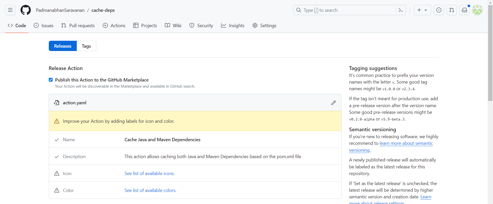
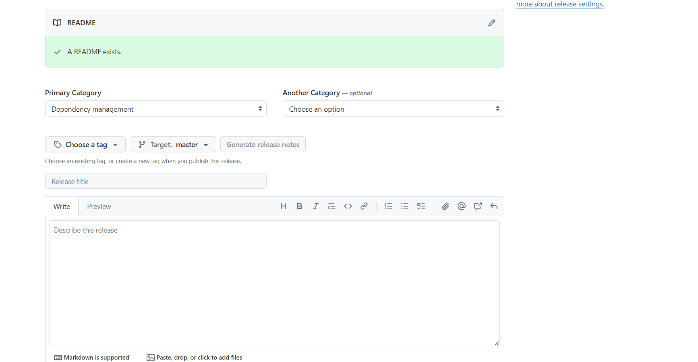

# Working with Custom Actions in GitHub Actions

GitHub Actions allows you to create custom actions, which are individual tasks that you can combine to automate your workflows. This README provides an overview of how to work with custom actions.

* [**Custom Actions**](#custom-actions)
* [**Types of Actions**](#types-of-actions)
* [**Choosing a Location for Your Action**](#choosing-a-location-for-your-action)
* [**Release Management for Actions**](#release-management-for-actions)
* [**Publish Custom Action to Marketplace**](#publish-custom-action-to-marketplace)
* [**Testing out your action in a workflow**](#testing-out-your-action-in-a-workflow)

## Custom Actions

Custom actions in GitHub Actions are your own tasks that interact with your repository in any way you want. You can use them to integrate with GitHub's APIs and third-party APIs. For example, you can create actions to publish npm modules, send alerts, or deploy code.

**Sharing Custom Actions**

- You can create actions for your workflows or share them with the GitHub community.
- To share actions with everyone, your repository must be public.

## Types of Actions

You can build three types of actions in GitHub Actions:

1. [**Composite Actions:**](#composite-actions)

    - Combine multiple workflow steps into a single action.
    - Useful for bundling multiple run commands into one action.
    - Simplify workflow configuration.

2. [**JavaScript Actions:**](#javascript-actions)

    - Run directly on runner machines.
    - Separate the action code from the environment.
    - Execute faster than Docker container actions.
    - Simplify the action code.

3. [**Docker Container Actions:**](#docker-container-actions) 

    - Package the environment with the action's code.
    - Provide a consistent and reliable unit of work.
    - Ideal for actions that require specific environment configurations.
    - Only execute on runners with a Linux operating system.

### **Composite Actions**

Composite actions are a straightforward type of custom action in GitHub Actions, allowing you to group multiple steps that can be executed together. Here's a step-by-step guide to creating a composite action

* [**Use Case for Composite Action**](#use-case-for-composite-action)
* [**Choose Location for the Action**](#choose-location-for-the-action)
* [**Create action.yaml File**](#create-action.yaml-file)
* [**Testing the Composite Action**](#testing-the-composite-action)

#### **Use Case for Composite Action**

* **Use Case:** Simplifying Java and Maven Dependency Setup

* **Scenario:** As a Java developer, you frequently work on projects that utilize Maven for dependency management. However, setting up the Java environment and installing dependencies can be time-consuming and error-prone. You want to streamline this process by creating a reusable GitHub Action that automates the setup of Java and Maven dependencies based on the pom.xml file.

* **Solution:** You create the "ANZ Setup Java" GitHub Action, which allows caching both Java and Maven dependencies. This action simplifies the setup process by providing the necessary tools and configurations to ensure a consistent development environment.

#### **Choose Location for the Action**

* If the action is intended for use within a single repository, it can be created within that repository.
* For actions intended to be shared among multiple repositories, it's best to create them in their own repository.
* When creating the action within an existing repository, it's a good practice to place it under the `.github/actions` folder.

  ```markdown
  .github/
    └── actions/
        ├── composite-dependencies/
        │   └── action.yaml
        └── my-action/
            └── action.yaml
  ```

#### **Create action.yaml File**

* In the chosen directory, create a file named `action.yaml`. This file defines the action's configuration.

```yaml
name: ANZ Setup Java
description: This action allows caching both Java and Maven Dependencies based on the pom.xml file

inputs: 
  java-version:
    description: 'Java version to use'
    default: '11'
    required: true
  working-dir:
    description: The working directory of the application
    default: .
    required: false

runs:
  using: 'composite'
  steps: 
    # Step 1: Setup Java version
    - name: Setup Java version ${{ inputs.java-version }}
      uses: actions/setup-java@v4
      with:
        distribution: 'adopt'
        java-version: ${{ inputs.java-version }}
        cache: 'maven'  # Cache Maven dependencies

    # Step 2: Install Dependencies
    - name: Install Dependencies
      run: mvn dependency:go-offline
      shell: bash
      working-directory: ${{ inputs.working-dir }}  # Set working directory for Maven command
```

This `action.yaml` file defines a composite action named "ANZ Setup Java" that sets up Java and Maven dependencies based on the specified Java version and working directory. It provides inputs for the Java version and working directory, allowing customization. The action utilizes the `actions/setup-java@v4` action to set up the Java environment and Maven dependencies caching. It then installs Maven dependencies using the `mvn dependency:go-offline` command. This action can be used in workflows to streamline the setup process for Java applications, improving build efficiency and reliability.

#### **Testing the Composite Action**

```yaml
name: 22-01-CustomActions-Composite
run-name: 22-01-CustomActions-Composite

on:
  workflow_dispatch:

env:
  working-directory: ./  # Default working directory

jobs:
  build:
    runs-on: ubuntu-latest
    steps:
      # Step 1: Checkout repository
      - name: checkout repository
        uses: actions/checkout@v4

      # Step 2: Setup Java & Maven dependencies
      - name: Setup Java & Maven dependencies
        uses: ./.github/actions/composite-cache-deps
        with:
          java-version: 11
          working-dir: ${{ env.working-directory }}  # Use specified working directory

      # Step 3: Run tests
      - name: Run tests
        run: mvn test

      # Step 4: Build with Maven
      - name: Build with Maven
        run: mvn clean install
```

**Setup Java & Maven Dependencies:**

* Utilizes the custom composite action (`./.github/actions/composite-cache-deps`) defined in the repository.
* Provides inputs:

  * `java-version`: Specifies the Java version to use (`11`).
  * `working-dir`: Specifies the working directory for the action.

* Sets up Java and Maven dependencies based on the provided inputs.

This workflow sets up Java and Maven dependencies using the custom composite action `composite-cache-deps` defined in the repository. It then runs tests and builds the project using Maven. By utilizing the composite action, the workflow streamlines the setup process for Java and Maven dependencies, making the workflow more efficient and maintainable.

### **JavaScript Actions**

A JavaScript (JS) custom action in the context of GitHub Actions is a reusable piece of automation logic written in JavaScript that can be executed as part of a GitHub Actions workflow. It allows you to perform specific tasks, interact with GitHub's APIs, or automate actions within your software development workflows.

* [**Use Case**](#use-case-for-javascript-actions)
* [**Choose Location for the JS Custom Action**](#choose-location-for-the-js-custom-action)
* [**Create action.yaml and index.js**](#create-action.yaml-and-index.js)
* [**Testing the JS Custom Action**](#testing-the-js-custom-action)

#### **Use Case for JavaScript Actions**

* **Use Case:** Automating NPM Dependency Updates and Creating Pull Requests

* **Scenario:** Your project relies on NPM packages, and you want to ensure that your dependencies are always up to date. However, manually checking for updates and creating pull requests for dependency updates can be time-consuming and error-prone. You want to automate this process to ensure that your project stays current with the latest package versions.

* **Solution:** You can create a custom GitHub Action that checks for updates to NPM packages, creates a pull request with the updated `package*.json` files, and notifies you of any available updates. This action can be triggered on a schedule or manually through the GitHub UI, providing a seamless way to keep your project dependencies up to date.

#### **Choose Location for the JS Custom Action**

* If the action is intended for use within a single repository, it can be created within that repository.
* For actions intended to be shared among multiple repositories, it's best to create them in their own repository.
* When creating the action within an existing repository, it's a good practice to place it under the `.github/actions` folder.

  ```markdown
  .github/
    └── actions/
        ├── js-dependencies/
        │   └── action.yaml
        └── my-action/
            └── action.yaml
  ```

#### **Create action.yaml and index.js**

**Action.yaml**

```yaml
name: Update NPM Dependencies
description: Checks if there are updates to NPM packages, and creates a PR with the updated package*.json files.

inputs:
  base-branch:
    description: The branch used as the base for the dependency update checks
    default: main
    required: false
  head-branch:
    description: The branch from which the PR is created
    default: update-dependencies
    required: false
  working-directory:
    description: The working directory of the project to check for dependency updates
    required: true
  gh-token:
    description: Authentication token with repository access. Must have write access to contents and pull-requests
    required: true
  debug:
    description: Whether the output debug messages to the console
    default: 'false'

outputs:
  updates-available:
    description: Whether there are updates available.

runs:
  using: node20
  main: index.js # The main entry point for the workflow
```

**index.js**

```js
const core = require('@actions/core');
const exec = require('@actions/exec');
const github = require('@actions/github');

// Function to set up git configuration
const setupGit = async () => {
  await exec.exec(`git config --global user.name "YourGitHubUsername"`);
  await exec.exec(`git config --global user.email "youremail@example.com"`);
};

// Function to validate branch name
const validateBranchName = ({ branchName }) =>
  /^[a-zA-Z0-9_\-\.\/]+$/.test(branchName);

// Function to validate directory name
const validateDirectoryName = ({ dirName }) =>
  /^[a-zA-Z0-9_\-\/]+$/.test(dirName);

// Function to set up logger
const setupLogger = ({ debug, prefix } = { debug: false, prefix: '' }) => ({
  debug: (message) => {
    if (debug) {
      core.info(`DEBUG ${prefix}${prefix ? ' : ' : ''}${message}`);
    }
  },
  info: (message) => {
    core.info(`${prefix}${prefix ? ' : ' : ''}${message}`);
  },
  error: (message) => {
    core.error(`${prefix}${prefix ? ' : ' : ''}${message}`);
  },
});

async function run() {
  // Retrieving inputs
  const baseBranch = core.getInput('base-branch', { required: true });
  const headBranch = core.getInput('head-branch', { required: true });
  const ghToken = core.getInput('gh-token', { required: true });
  const workingDir = core.getInput('working-directory', { required: true });
  const debug = core.getBooleanInput('debug');
  const logger = setupLogger({ debug, prefix: '[js-dependency-update]' });

  // Setting GitHub token as a secret
  core.setSecret(ghToken);

  logger.debug('Validating inputs base-branch, head-branch, working-directory');

  // Validating branch and directory names
  if (!validateBranchName({ branchName: baseBranch })) {
    core.setFailed(
      'Invalid base-branch name. Branch names should include only characters, numbers, hyphens, underscores, dots, and forward slashes.'
    );
    return;
  }

  if (!validateBranchName({ branchName: headBranch })) {
    core.setFailed(
      'Invalid head-branch name. Branch names should include only characters, numbers, hyphens, underscores, dots, and forward slashes.'
    );
    return;
  }

  if (!validateDirectoryName({ dirName: workingDir })) {
    core.setFailed(
      'Invalid working directory name. Directory names should include only characters, numbers, hyphens, underscores, and forward slashes.'
    );
    return;
  }

  logger.debug(`Base branch is ${baseBranch}`);
  logger.debug(`Head branch is ${headBranch}`);
  logger.debug(`Working directory is ${workingDir}`);

  logger.debug('Checking for package updates');

  // Running npm update
  await exec.exec('npm update', [], {
    cwd: workingDir,
  });

  // Checking git status for package.json files
  const gitStatus = await exec.getExecOutput(
    'git status -s package*.json',
    [],
    {
      cwd: workingDir,
    }
  );

  let updatesAvailable = false;

  if (gitStatus.stdout.length > 0) {
    updatesAvailable = true;

    logger.debug('There are updates available!');
    logger.debug('Setting up git');

    // Setting up git configuration
    await setupGit();

    // Creating a new branch, adding and committing changes, and pushing to remote
    await exec.exec(`git checkout -b ${headBranch}`, [], {
      cwd: workingDir,
    });
    await exec.exec(`git add package.json package-lock.json`, [], {
      cwd: workingDir,
    });
    await exec.exec(`git commit -m "chore: update dependencies"`, [], {
      cwd: workingDir,
    });
    await exec.exec(`git push -u origin ${headBranch} --force`, [], {
      cwd: workingDir,
    });

    logger.debug('Fetching octokit API');

    // Creating a PR using octokit
    const octokit = github.getOctokit(ghToken);

    try {
      logger.debug(`Creating PR using head branch ${headBranch}`);

      await octokit.rest.pulls.create({
        owner: github.context.repo.owner,
        repo: github.context.repo.repo,
        title: `Update NPM dependencies`,
        body: `This pull request updates NPM packages`,
        base: baseBranch,
        head: headBranch,
      });
    } catch (e) {
      logger.error(
        'Something went wrong while creating the PR. Check logs below.'
      );
      core.setFailed(e.message);
      logger.error(e);
    }
  } else {
    logger.info('No updates at this point in time.');
  }

  logger.debug(`Setting updates-available output to ${updatesAvailable}`);
  core.setOutput('updates-available', updatesAvailable);
}

run();
```

**Install Dependencies**

Since the `index.js` file uses `@actions/core`, `@actions/exec`, and `@actions/github` packages, make sure to install them as dependencies. You can do this by running the following command in your terminal:

```npm
npm install @actions/core @actions/exec @actions/github
```

#### **Testing the JS Custom Action**

To test the JS custom action `js-dependency-update`, you can create a GitHub Actions workflow (`22-02-CustomActions-JS`) that utilizes this action. Below is an example workflow configuration for testing the custom action:

```yaml
name: 22-02-CustomActions-JS
run-name: 22-02-CustomActions-JS | BB - ${{ inputs.base-branch }} TB - ${{ inputs.target-branch }} WD - ${{ inputs.working-dir }}

on:
  workflow_dispatch:
    inputs:
      base-branch:
        type: string
        default: main
      target-branch:
        type: string
        default: update-dependencies
      working-dir:
        type: string
        default: 08-CustomActions/react-app
      debug:
        type: boolean
        default: false

permissions:
  contents: write
  pull-requests: write

jobs:
  dependency-update:
    runs-on: ubuntu-latest
    steps:
      # Step 1: Checkout code
      - uses: actions/checkout@v4

      # Step 2: Check for dependency updates
      - name: Check for dependency updates
        uses: ./.github/actions/js-dependency-update
        with:
          base-branch: ${{ inputs.base-branch }}
          head-branch: ${{ inputs.target-branch }}
          working-directory: ${{ inputs.working-dir }}
          gh-token: ${{ secrets.GITHUB_TOKEN }}
          debug: ${{ inputs.debug }}  # Debug mode enabled or disabled
```

**Job: Dependency Update:**

* Defines a job named `dependency-update` that runs on an Ubuntu environment.
* Utilizes `actions/checkout` to clone the repository into the workflow's workspace.
* Executes the `js-dependency-update` custom action to check for dependency updates, using inputs provided via workflow dispatch.

### **Docker Container Actions**

A Docker container action is a type of GitHub Action that runs within a Docker container environment. Unlike JavaScript or composite actions, which execute within the GitHub-hosted runners, Docker container actions provide a more flexible and customizable execution environment by running within a Docker container specified by the user.

* [**Use Case for Docker Custom Action**](#use-case-for-docker-custom-action)
* [**Choose Location for the Docker Container Custom Action**](#choose-location-for-the-docker-container-custom-action)
* [**Create action.yaml and Dockerfile**](#create-action.yaml-and-dockerfile)
* [**Testing the Docker Custom Action**](#testing-the-docker-custom-action)

#### **Use Case for Docker Custom Action**

* **Use Case:** (`Continuous URL Monitoring Action`)You need a solution to continuously ping a URL until a specific condition is met, such as receiving a successful response or reaching a maximum number of trials. This functionality is crucial for monitoring services and ensuring their availability.

* **Scenario:** As a DevOps engineer, you want to create a GitHub Action that can repeatedly ping a URL and check for a successful response. If the URL does not return a status code of 200 within a specified number of trials, the action should fail. This action will be useful for monitoring critical endpoints and triggering alerts if there are any issues.

* **Solution:** You develop the "Ping URL" Docker Custom Action, which allows users to specify a URL to ping and the maximum number of trials before the action fails. The action runs in a Docker container, ensuring portability and consistency across different environments. It utilizes Python and the `requests` library to send HTTP requests to the specified URL and checks the response status code.

#### **Choose Location for the Docker Container Custom Action**

* If the action is intended for use within a single repository, it can be created within that repository.
* For actions intended to be shared among multiple repositories, it's best to create them in their own repository.
* When creating the action within an existing repository, it's a good practice to place it under the `.github/actions` folder.

  ```markdown
  .github/
    └── actions/
        ├── docker/
        │   └── action.yaml
        └── my-action/
            └── action.yaml
  ```

#### **Create action.yaml and Dockerfile**

**action.yaml**

```yaml
name: Ping URL
description: Ping URL until maximum trials have exceeded. If result is not 200 until then, fails the action.

inputs:
  url: # INPUT_URL
    description: URL to ping.
    required: true
  max_trials: # INPUT_MAX-TRIALS
    description: Maximum number of trials until action fails.
    default: '10'
    required: false
  delay:
    description: Delay in seconds between trials.
    default: '5'
    required: false

runs:
  using: docker
  image: Dockerfile
```

**Dockerfile**

```Dockerfile
FROM python:alpine3.19

WORKDIR /app

COPY requirements.txt .

RUN python -V
RUN pip install --no-cache-dir -r requirements.txt

COPY . .

CMD [ "python", "/app/main.py" ]
```

#### **Testing the Docker Custom Action**

To test the "Ping URL" Docker Custom Action, follow these steps:

* Create a Python script (`main.py`) in the root directory of your project. This script should handle the logic to ping the URL and check for a successful response.

```python
import os
import requests
import time

def ping_url(url,delay,max_trials):
    trials = 0

    while trials < max_trials:
        try:
            response = requests.get(url)
            if response.status_code == 200:
                print(f"Website {url} is reachable.")
                return True
        except requests.ConnectionError:
            print(f"Website {url} is unreachable. Retrying in {delay} seconds...")
            time.sleep(delay)
            trials += 1
        except requests.exceptions.MissingSchema:
            print(f"Invalid URL format: {url}. Make sure the URL has a valid schema (e.g., http:// or https://)")
            return False
        
    return False

def run():
    website_url = os.getenv("INPUT_URL")
    delay = int(os.getenv("INPUT_DELAY"))
    max_trials = int(os.getenv("INPUT_MAX_TRIALS"))
    
    website_reachable = ping_url(website_url,delay,max_trials)

    if not website_reachable:
        raise Exception(f"Website {website_url} is malformed or unreachable.")
    
    print(f"Website {website_url} is reachable.")

if __name__ == "__main__":
    run()
```

* Define a `requirements.txt` file listing the dependencies required for the Python script, such as the requests library.

* Create a workflow file (e.g., ping_url_workflow.yml) in the .github/workflows directory of your repository. This workflow file should utilize the "Ping URL" action, passing the necessary inputs like the URL to ping.

```yaml
name: 22-03-CustomActions-Docker

on:
  workflow_dispatch:
    inputs:
      url:
        type: choice
        options:
          - 'https://www.google.com'
          - 'https://www.invalid-aidmdkjmcdkx.com'
          - 'invalid-aidmdkjmcdkx'
      max_trials:
        description: Maximum trials until action fails.
        default: '10'
        required: false
      delay:
        description: Delay in seconds between trials.
        default: '5'
        required: false

jobs:
  ping-url:
    runs-on: ubuntu-latest
    steps:
      - uses: actions/checkout@v4
      - name: Ping URL
        uses: ./.github/actions/docker-ping-url
        with:
          url: ${{ inputs.url }}
          max_trials: ${{ inputs.max_trials }}
          delay: ${{ inputs.delay }}
```

* Trigger the workflow either manually or by pushing a commit to the repository. Monitor the workflow execution in the Actions tab of your GitHub repository.

* Verify the results: The workflow should repeatedly ping the specified URL until either a successful response (HTTP status code 200) is received or the maximum number of trials is exceeded. If the URL does not return a 200 status code within the specified trials, the action should fail.

## **Choosing a Location for Your Action**

* [**For Public Use**](#for-public-use)
* [**For Private Use**](#for-private-use)

### **For Public Use**

* **Own Public Repository:** Keep your actions in their own public repository. This provides several benefits:

  - **Versioning:** You can version your actions just like any other software, making it easier for users to track changes and select specific versions.
  - **Tracking and Releasing:** You can use GitHub's built-in release management features to track changes and release new versions of your action.
  - **Community Contribution:** Hosting your action in a public repository makes it easier for the GitHub community to discover, use, and contribute to your action. Users can open issues, submit pull requests, and provide feedback more effectively.

### **For Private Use**

**Within Single Repository:**

- If the action is only needed in a single repository, you can create it within that repository. This keeps everything self-contained and simplifies management.

**In Its Own Repository:**

- If the action is needed in multiple repositories or if you want to maintain separation of concerns, it should be in its own repository with the appropriate access permissions.
- This ensures that the action can be easily referenced and used across different projects without duplicating code.

## **Release Management for Actions**

- Use release management to control how you distribute updates to your actions.
- Users should specify a major version when using your action and update it only if needed.

  * [**Using Tags for Release Management**](#using-tags-for-release-management)
  * [**Using Branches for Release Management**](#using-branches-for-release-management)
  * [**Using a Commit's SHA for Release Management**](#using-a-commits-sha-for-release-management)
  * [**Documentation**](#documentation)

### **Using Tags for Release Management**

- Tags and releases are commonly used in GitHub Actions for versioning and release management.

- **Semantic Versioning:**

  - Follow semantic versioning (SemVer) when creating releases and tags. Semantic versioning consists of three parts: `major.minor.patch`. Increment the `major` version for incompatible changes, `minor` version for backward-compatible features, and `patch` version for backward-compatible bug fixes.

- **Updating Major Version Tags:**

  - Move major version tags (`v1`, `v2`, etc.) to point to the Git reference (commit or tag) of the current release. This ensures that users who reference specific major versions always get the latest updates within that major version.

### **Using Branches for Release Management**

- Branches can also be used for release management, especially for users who prefer working with branch names instead of tags.

- **Referencing Named Branches:**

  - Users can reference a named branch (e.g., `main`, `master`, `development`) for the action. This approach allows for continuous integration and testing against the latest changes in the branch.

### **Using a Commits SHA for Release Management**

- Each commit in Git has a unique SHA (Secure Hash Algorithm) identifier. Referencing commits' SHA values is another approach to release management.

- **Referencing Commit SHA:**

  - Users can reference the full SHA value of a commit to ensure stability and reproducibility. This is useful when users want to lock down their workflows to specific versions for consistency.

### **Documentation**

In addition to implementing release management strategies, it's essential to provide comprehensive documentation for your actions. A `README` file for your action should include:

* **Description:** Clearly explain what the action does and its intended use case.
* **Input/Output Arguments:** Document the input and output arguments the action accepts and produces.
* **Secrets:** If the action requires any secrets, document how users should configure them securely.
* **Environment Variables:** List any environment variables the action uses and their purposes.
* **Workflow Examples:** Provide examples of how to integrate the action into workflows, demonstrating common use cases.

## **Publish Custom Action to Marketplace**

* Create a new public repository on GitHub.com. You can choose any repository name, or use the following `cache-deps` example.
* Clone your repository to your computer. 
* In the `cache-deps` repository, create a new file called `action.yml` and add the following example code. 

  ```yaml
  name: Cache Java and Maven Dependencies
  description: This action allows caching both Java and Maven Dependencies based on the pom.xml file
  
  inputs: 
    java-version:
      description: 'Java version to use'
      default: '11'
      required: true
    working-dir:
      description: The working directory of the application
      default: .
      required: false
  
  runs:
    using: 'composite'
    steps: 
      - name: Setup Java version ${{ inputs.java-version }}
        uses: actions/setup-java@v4
        with:
          distribution: 'adopt'
          java-version: ${{ inputs.java-version }}
          cache: 'maven'
  
      - name: Install Dependencies
        run: mvn dependency:go-offline
        shell: bash
        working-directory: ${{ inputs.working-dir }}
  ```

* From your terminal, check in your action.yml file.

  ```git
  git add action.yml
  git commit -m "Add action"
  git push
  ```

* From your terminal, add a tag. This example uses a tag called v1.

  ```git
  git tag -a -m "Description of this release" v1
  git push --follow-tags
  ```

* Create a new release:

  * Go to your repository on GitHub.
  * Click on the "Releases" tab.
  * Click on "Draft a new release".



* Mark as publish this action to the GitHub Marketplace:

  * you'll see an option to "Publish this action to the GitHub Marketplace". Check this option.

* Enable Two-Factor Authentication (2FA):

  * If you haven't already enabled Two-Factor Authentication for your GitHub account, you'll need to do so. Follow the instructions provided by GitHub to set it up.

* Select the tag and then release:

  * When creating a new release, ensure you select the appropriate tag/version that corresponds to your action's release.



* Review and confirm:

  * Review all the details of your release, ensuring everything is accurate.
  * Once satisfied, click on "Publish release".

* Verify the action on GitHub Marketplace:

  * After publishing the release, navigate to the "Marketplace" tab of your GitHub repository.
  * You should see your action listed there.
  * Users can now discover and install your action from the GitHub Marketplace.

## **Testing out your action in a workflow**

* Copy the workflow code into a `.github/workflows/custom-composite-actions.yml` file in another repository, but replace `repository-name/cache-deps@v1` with the repository and tag you created. 

  ```yaml
  name: 22-01-Custom Actions-Composite
  run-name: 22-01-Custom Actions-Composite
  
  on:
    workflow_dispatch:
  
  env:
    working-directory: ./
  
  jobs:
    build:
      runs-on: ubuntu-latest
      steps:
        - name: checkout repository
          uses: actions/checkout@v4
  
        - name: Setup Java & Maven dependencies
          uses: your-repository-name/cache-deps@v1
          with:
            java-version: 11
            working-dir: ${{ env.working-directory }}
  
        - name: Run tests
          run: mvn test
  
        - name: Build with Maven
          run: mvn clean install
  ```

* Run the workflow