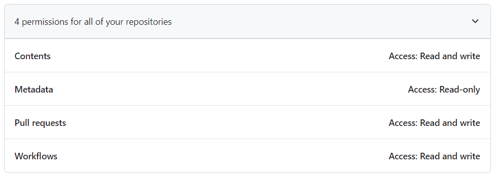
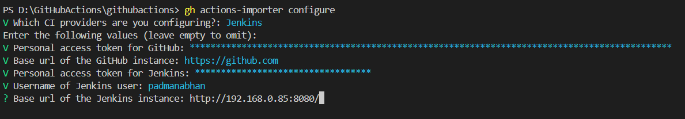
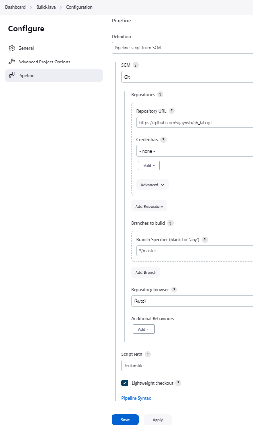
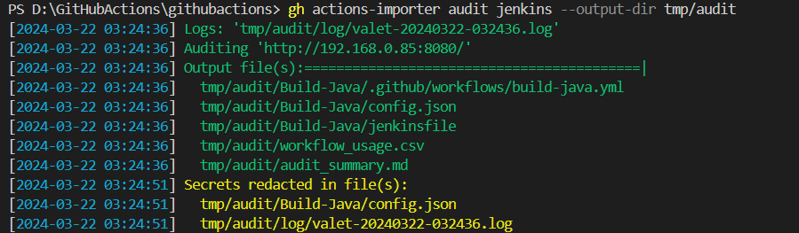
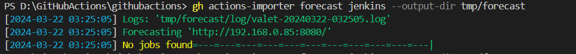
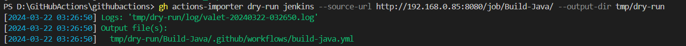
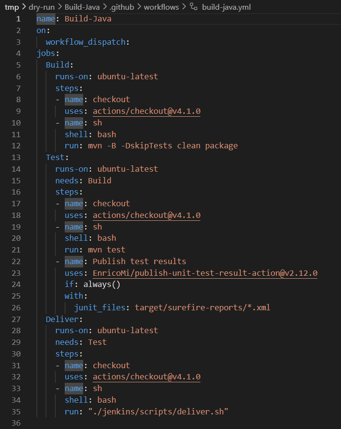
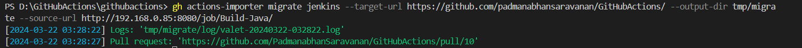

# Jenkins to Github Actions Migration 

## Prerequisites

* **Jenkins Account or Organization:** You need access to a Jenkins account or organization where pipelines and jobs you want to convert are located.
* **GitHub Account:** You need a GitHub account where you'll be migrating the Jenkins pipelines to GitHub Actions.
* **Access to Create a Jenkins Personal API Token:** You'll need to create a personal API token in Jenkins to authenticate with the Jenkins server during migration.
* **Environment with Linux-Based Containers and Docker Installed:** Ensure you have an environment where you can run Linux-based containers with Docker installed.
* **GitHub Personal Access Token:** Create a GitHub personal access token with the "workflow" scope to authenticate with GitHub during migration.
* **Access to GitHub CLI:** Make sure GitHub CLI (gh) is installed and accessible in your environment.
* **Network Access:** Ensure network access to Jenkins server from the environment where migration commands will be executed.
* **Jenkins Plugin Installation:** Install the "paginated-builds" plugin on your Jenkins server to facilitate data retrieval for forecasting.
* **Custom Docker Image (Optional):** If you plan to use a custom Docker image for running Jenkins, ensure it's available and properly configured.
* **GitHub Repository:** Have a GitHub repository where you'll be migrating the Jenkins pipelines to GitHub Actions.

## Migrating from Jenkins with GitHub Actions Importer

* [**Installing GitHub Actions Importer CLI Extension**](#installing-github-actions-importer-cli-extension)
* [**Setup Jenkins**](#setup-jenkins)
* [**Perform an audit of Jenkins**](#perform-an-audit-of-jenkins)
* [**Forecast potential build runner usage**](#forecast-potential-build-runner-usage)
* [**Perform a dry run migration of a Jenkins pipeline**](#perform-a-dry-run-migration-of-a-jenkins-pipeline)
* [**Perform a production migration of a Jenkins pipeline**](#perform-a-production-migration-of-a-jenkins-pipeline)

### **Installing GitHub Actions Importer CLI Extension**

**1. Install GitHub Actions Importer CLI extension:**

Before installing action importer , install github cli [link](https://cli.github.com/)

Use the provided command to install the GitHub Actions Importer CLI extension, which will enable you to migrate Jenkins pipelines to GitHub Actions.

```gh
gh extension install github/gh-actions-importer
```

**2. Verify the installation:**

After installation, verify that the extension is installed correctly by running:

```gh
gh actions-importer -h
```

#### **Running Jenkins on Docker Windows Host Machine**

**1. Create Docker Network:**

Create a Docker network named "jenkins" to allow communication between containers.

```docker
docker network create jenkins
```

**2. Run Docker Daemon Exposed with Port 2376:**

Start a Docker daemon with necessary configurations for Jenkins usage.

```docker
docker run --name jenkins-docker --rm --detach \
--privileged --network jenkins --network-alias docker \
--env DOCKER_TLS_CERTDIR=/certs \
--volume jenkins-docker-certs:/certs/client \
--volume jenkins-data:/var/jenkins_home \
--publish 2376:2376 \
docker:dind
```

**3. Run Jenkins Image:**

Start Jenkins container using a custom image or the official Jenkins image, ensuring it's properly configured.

```docker
docker run --name jenkins-blueocean --restart=on-failure --detach \
--network jenkins --env DOCKER_HOST=tcp://docker:2376 \
--env DOCKER_CERT_PATH=/certs/client --env DOCKER_TLS_VERIFY=1 \
--volume jenkins-data:/var/jenkins_home \
--volume jenkins-docker-certs:/certs/client:ro \
--publish 8080:8080 --publish 50000:50000 vijaynvb/jenkins:1.0
```

**Setup admin details**

- Access the jenkins application in localhost:8080
- Login with default credentials - To get the password , go to the shown directory or simply run docker logs containerId & get the password from logs.
- Install suggested plugins
- Create new user 'administrator' with password '**\*\*\*\***'
- Now start jenkins

#### **Configuring Credentials**

**1. Create GitHub Personal Access Token:**

Generate a GitHub personal access token with the `"workflow"`,`"contents"`,`"Pull Request"`,`"Metadata"` scope from your GitHub account settings. This token will be used to authenticate GitHub Actions Importer with GitHub.

> Notes:
> 
> Creating a GitHub Personal Access Token:
> 
> * Go to your GitHub account settings.
> * Navigate to the "Developer settings" section.
> * Click on "Personal access tokens."
> * Click on "Generate new token."
> * Give your token a name and select the required scopes, ensuring the "workflow","contents","Pull Request","Metadata" scope is included.
> * Click on "Generate token" and copy the generated token. Save it in a secure location as it will not be displayed again.

**Perssions required for GitHub Personal Access Token**



**2. Create Jenkins API Token:**

Log in to your Jenkins instance and generate an API token from your user profile or settings. This token will be used to authenticate GitHub Actions Importer with Jenkins.

> Notes:
>
> Finding Jenkins API Token and Base URL:
> 
> * Log in to your Jenkins instance.
> * Navigate to your user profile or settings.
> * Look for an option to generate an API token. This token will be used to authenticate with Jenkins.
> * Once generated, copy the API token and save it in a secure location.
> 
> Jenkins Base URL:
> 
> * The Jenkins base URL is simply the URL of your Jenkins instance. It typically follows the format http://your-jenkins-domain.com or http://localhost:8080 if running locally. ( use system ip address instead of localhost , ipconfig )
> * Ensure you have the correct URL, including the protocol (http/https) and port number if applicable.

**3. Configure GitHub Actions Importer:**

Run the configuration command provided below, and follow the prompts to configure GitHub Actions Importer with the necessary credentials.

```gh
gh actions-importer configure
```

Provide the required information:

* Select Jenkins as the CI provider.
* Enter the GitHub personal access token.
* Accept the default GitHub base URL.
* Enter the Jenkins API token, username, and Jenkins base URL.



#### **Updating Container Image**

Update the container image for GitHub Actions Importer if needed.

```gh
gh actions-importer update
```

These steps provide a seamless way to install GitHub Actions Importer, configure credentials, set up Jenkins on Docker, and update the necessary container images.

### **Setup Jenkins**

**Create your Pipeline project in Jenkins**

* In Jenkins, select **New Item** under **Dashboard >** at the top left.
* Enter your new Pipeline project name in **Enter an item name**(`Build-Java`).
* Scroll down if necessary and select **Pipeline**, then select OK at the end of the page.
* (Optional) Enter a Pipeline **Description**.
* Select **Pipeline** on the left pane.



* Select Definition, and then choose the **Pipeline script from SCM** option. This option instructs Jenkins to obtain your Pipeline from the source control management (SCM), which is your forked Git repository.
* Choose **Git** from the options in SCM.
* Enter the URL of your repository in **Repositories/Repository URL**.(`https://github.com/vijaynvb/gh_lab.git`)
* Select Save at the end of the page. You’re now ready to create a Jenkinsfile to check into your locally cloned Git repository.

**Jenkinfile**

* Create a `Jenkinfile` in your repository and add the below script and push the script to your repository

```Jenkinfile
pipeline {
    agent any
    stages {
        stage('Build') {
            steps {
                sh 'mvn -B -DskipTests clean package'
            }
        }
        stage('Test') {
            steps {
                sh 'mvn test'
            }
            post {
                always {
                    junit 'target/surefire-reports/*.xml'
                }
            }
        }
        stage('Deliver') {
            steps {
                sh './jenkins/scripts/deliver.sh'
            }
        }
    }
}
```

### **Perform an audit of Jenkins**

You can use the `audit` command to get a high-level view of all pipelines in a Jenkins server.

The `audit` command performs the following steps:

* Fetches all of the projects defined in a Jenkins server.
* Converts each pipeline to its equivalent GitHub Actions workflow.
* Generates a report that summarizes how complete and complex of a migration is possible with GitHub Actions Importer.

#### **Run the Audit Command**

Open your terminal and run the following command:

```gh
gh actions-importer audit jenkins --output-dir tmp/audit
```



* `gh actions-importer audit jenkins:` This part of the command invokes the GitHub Actions Importer to perform an audit on Jenkins pipelines.
* `--output-dir tmp/audit:` This flag specifies the output directory where the audit results will be stored. In this case, it's set to `tmp/audit`.

#### **Inspect Audit Results**

The files in the specified output directory contain the results of the audit. See the `audit_summary.md` file for a summary of the audit results.

**The audit summary has the following sections.**

* **Pipelines**

  The "Pipelines" section contains a high-level statistics regarding the conversion rate done by GitHub Actions Importer.

  Listed below are some key terms that can appear in the "Pipelines" section:

  * **Successful** pipelines had 100% of the pipeline constructs and individual items converted automatically to their GitHub Actions equivalent.
  * **Partially successful** pipelines had all of the pipeline constructs converted, however, there were some individual items that were not converted automatically to their GitHub Actions equivalent.
  * **Unsupported** pipelines are definition types that are not supported by GitHub Actions Importer.
  * **Failed** pipelines encountered a fatal error when being converted. This can occur for one of three reasons:

    * The pipeline was misconfigured and not valid.
    * GitHub Actions Importer encountered an internal error when converting it.
    * There was an unsuccessful network response that caused the pipeline to be inaccessible, which is often due to invalid credentials.

* **Build steps**

  The "Build steps" section contains an overview of individual build steps that are used across all pipelines, and how many were automatically converted by GitHub Actions Importer.

  Listed below are some key terms that can appear in the "Build steps" section:

  * A **known** build step is a step that was automatically converted to an equivalent action.
  * An **unknown** build step is a step that was not automatically converted to an equivalent action.
  * An **unsupported** build step is a step that is either

    * Fundamentally not supported by GitHub Actions.
    * Configured in a way that is incompatible with GitHub Actions.

  * An **action** is a list of the actions that were used in the converted workflows. This can be important for:

    * If you use GitHub Enterprise Server, gathering the list of actions to sync to your instance.
    * Defining an organization-level allowlist of actions that are used. This list of actions is a comprehensive list of actions that your security or compliance teams may need to review.

* **Manual tasks**

  The "Manual tasks" section contains an overview of tasks that GitHub Actions Importer is not able to complete automatically, and that you must complete manually.

  Listed below are some key terms that can appear in the "Manual tasks" section:

  * A **secret** is a repository or organization-level secret that is used in the converted pipelines. These secrets must be created manually in GitHub Actions for these pipelines to function properly.
  * A **self-hosted** runner refers to a label of a runner that is referenced in a converted pipeline that is not a GitHub-hosted runner. You will need to manually define these runners for these pipelines to function properly.

* **Files**

  The final section of the audit report provides a manifest of all the files that were written to disk during the audit.
  
  Each pipeline file has a variety of files included in the audit, including:

  * The original pipeline as it was defined in GitHub.
  * Any network responses used to convert the pipeline.
  * The converted workflow file.
  * Stack traces that can be used to troubleshoot a failed pipeline conversion.

Additionally, the `workflow_usage.csv` file contains a comma-separated list of all actions, secrets, and runners that are used by each successfully converted pipeline. This can be useful for determining which workflows use which actions, secrets, or runners, and can be useful for performing security reviews.

### **Forecast potential build runner usage**

You can use the `forecast` command to forecast potential GitHub Actions usage by computing metrics from completed pipeline runs in your Jenkins server.

The purpose of running the `forecast` command is to analyze historical data from Jenkins pipelines and generate insights that can aid in planning the migration process to GitHub Actions.

**Prerequisites:**

Install the paginated-builds plugin on your Jenkins server. This plugin allows GitHub Actions Importer to efficiently retrieve historical build data for jobs with a large number of builds.

* Navigate to your Jenkins instance's plugin manager at `https://<your-jenkins-instance>/pluginManager/available`.
* Search for the `"paginated-builds"` plugin.
* Check the box next to it and select `"Install without restart"`.

#### **Running the Forecast Command**

Open your terminal and run the following command:

```gh
gh actions-importer forecast jenkins --output-dir tmp/forecast
```



* `gh actions-importer forecast jenkins`: This part of the command instructs the GitHub CLI tool to run the forecast functionality specifically for Jenkins pipelines. The GitHub Actions Importer tool is designed to analyze Jenkins pipelines and provide insights into potential migration to GitHub Actions.

* `--output-dir tmp/forecast`: This flag specifies the output directory where the forecast analysis results will be stored. In this case, it's set to `tmp/forecast`. The forecast analysis generates various metrics and reports, which are saved in this directory for further inspection.

#### **Inspecting the Forecast Report**

The `forecast_report.md` file in the specified output directory contains the results of the forecast.

Listed below are some key terms that can appear in the forecast report:

* The `job count` is the total number of completed jobs.
* The `pipeline count` is the number of unique pipelines used.
* `Execution time` describes the amount of time a runner spent on a job. This metric can be used to help plan for the cost of GitHub-hosted runners.

  * This metric is correlated to how much you should expect to spend in GitHub Actions. This will vary depending on the hardware used for these minutes. 

* `Queue time` metrics describe the amount of time a job spent waiting for a runner to be available to execute it.
* `Concurrent jobs` metrics describe the amount of jobs running at any given time. This metric can be used to define the number of runners you should configure.

Additionally, these metrics are defined for each queue of runners in Jenkins. This is especially useful if there is a mix of hosted or self-hosted runners, or high or low spec machines, so you can see metrics specific to different types of runners.

### **Perform a dry run migration of a Jenkins pipeline**

The purpose of running the `dry-run` command is to simulate the migration of a Jenkins pipeline to GitHub Actions without actually making any changes to the pipeline or repository. It allows users to preview how their pipelines would be converted and assess the feasibility of migration.

#### **Running the Dry-Run Command**

* Open your terminal.
* Run the following command, replacing `https://jenkins.xyz/job/:job_name` with the URL of your Jenkins job:

  ```gh
  gh actions-importer dry-run jenkins --source-url http://192.168.0.85:8080/job/Build-Java/ --output-dir tmp/dry-run
  ```



  * `gh actions-importer dry-run jenkins`: This part of the command instructs the GitHub CLI tool to perform a dry run migration specifically for Jenkins pipelines. The dry run simulation allows users to see how their Jenkins pipeline would be converted into GitHub Actions workflows without making any actual changes to the pipeline or repository.

  * `--source-url https://jenkins.xyz/job/:job_name`: This flag specifies the source URL of the Jenkins project that you want to migrate. Replace `https://jenkins.xyz/job/:job_name` with the `actual URL` of your Jenkins project.

  * `--output-dir tmp/dry-run`: This flag specifies the output directory where the results of the dry run migration will be stored. In this case, it's set to `tmp/dry-run`. The dry run process generates files and logs that represent the converted GitHub Actions workflows and other relevant information.

#### **Inspecting the Converted Workflows**



* After running the command, you can inspect the logs of the dry run and the converted workflow files in the specified output directory (tmp/dry-run).
* Within the output directory, you'll find the converted workflow files generated by the dry run process. These files represent the GitHub Actions workflows equivalent to your Jenkins pipelines.

### **Perform a production migration of a Jenkins pipeline**

You can use the `migrate` command to convert a Jenkins pipeline and open a pull request with the equivalent GitHub Actions workflow.

#### **Running the Migrate Command**

* Open your terminal.
* To migrate a Jenkins pipeline to GitHub Actions, run the following command in your terminal, replacing the `target-url` value with the `URL` for your **GitHub repository**, and `my-jenkins-project` with the `URL` for your **Jenkins job**.

  ```gh
   gh actions-importer migrate jenkins --target-url https://github.com/vijaynvb/gh_lab --output-dir tmp/migrate --source-url http://192.168.0.85:8080/job/Build-Java/
  ```



  * `gh actions-importer migrate jenkins`: This part of the command instructs the GitHub CLI tool to perform the migration specifically for Jenkins pipelines. The migration process involves converting Jenkins pipeline configurations into GitHub Actions workflows.

  * `--target-url https://github.com/:owner/:repo`: This flag specifies the target GitHub repository where the converted GitHub Actions workflows will be created. Replace `:owner` with your GitHub username or organization name and `:repo` with the name of your repository.

  * `--output-dir tmp/migrate`: This flag specifies the output directory where the results of the migration process will be stored. In this case, it's set to `tmp/migrate`. The migration process generates files, logs, and other relevant information, which are stored in this directory.

  * `--source-url https://jenkins.xyz/job/:job_name`: This flag specifies the source URL of the Jenkins project that you want to migrate. Replace `https://jenkins.xyz/job/:job_name` with the `actual URL` of your **Jenkins project**.

#### **Inspecting the pull request**

The output from a successful run of the migrate command contains a link to the new pull request that adds the converted workflow to your repository.


Some important elements of the pull request include:

* In the pull request description, a section called **Manual steps**, which lists steps that you must manually complete before you can finish migrating your pipelines to GitHub Actions. For example, this section might tell you to create any secrets used in your workflows.
* The converted workflows file. Select the **Files changed** tab in the pull request to view the workflow file that will be added to your GitHub repository.

When you are finished inspecting the pull request, you can merge it to add the workflow to your GitHub repository.
