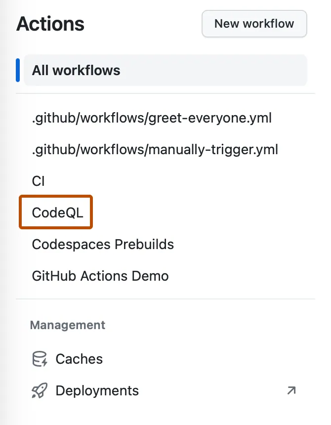
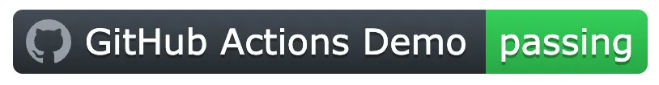
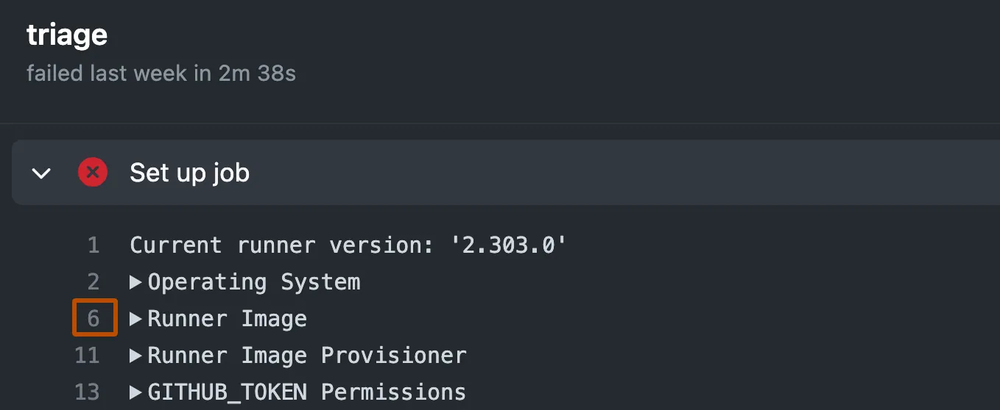
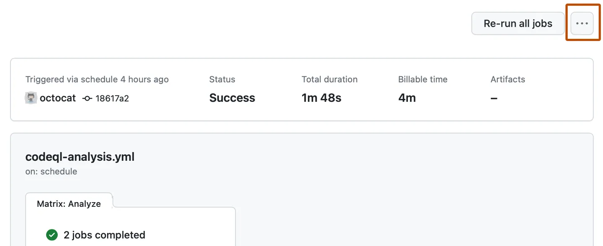

# Monitoring and observability 

You can use the tools in GitHub Actions to monitor and debug your workflows.

* [Using the visualization graph](#using-the-visualization-graph)
* [Adding a workflow status badge](#adding-a-workflow-status-badge)
* [Viewing workflow run history](#viewing-workflow-run-history)
* [Viewing job execution time](#viewing-job-execution-time)
* [Using workflow run logs](#using-workflow-run-logs)
* [Enabling debug logging](#enabling-debug-logging)
* [Notifications for workflow runs](#notifications-for-workflow-runs)

## Using the visualization graph

Every workflow run generates a real-time graph that illustrates the run progress. You can use this graph to monitor and debug workflows.

* On GitHub.com, navigate to the main page of the repository.

* Under your repository name, click Actions.


* In the left sidebar, click the workflow you want to see.



* From the list of workflow runs, click the name of the run to see the workflow run summary.

* The graph displays each job in the workflow. An icon to the left of the job name indicates the status of the job. Lines between jobs indicate dependencies.


* To view a job's log, click the job.

## Adding a workflow status badge

You can display a status badge in your repository to indicate the status of your workflows.

A status badge shows whether a workflow is currently failing or passing. A common place to add a status badge is in the `README.md` file of your repository, but you can add it to any web page you'd like. By default, badges display the status of your default branch. You can also display the status of a workflow run for a specific branch or event using the `branch` and `event` query parameters in the URL.



**Using the workflow file name**

You can build the URL for a workflow status badge using the name of the workflow file:

```
https://github.com/OWNER/REPOSITORY/actions/workflows/WORKFLOW-FILE/badge.svg
```

To display the workflow status badge in your `README.md` file, use the Markdown markup for embedding images.

For example, add the following Markdown to your `README.md` file to add a status badge for a workflow with the file path `.github/workflows/main.yml`. The `OWNER` of the repository is the `github` organization and the `REPOSITORY` name is `docs`.

```markdown

```

**Using the `branch` parameter**

To display the status of a workflow run for a specific branch, add `?branch=BRANCH-NAME` to the end of the status badge URL.

For example, add the following Markdown to your `README.md` file to display a status badge for a branch with the name `feature-1`.

```markdown

```

**Using the `event` parameter**

To display the status of workflow runs triggered by the `push` event, add `?event=push` to the end of the status badge URL.

For example, add the following Markdown to your `README.md` file to display a badge with the status of workflow runs triggered by the `push` event, which will show the status of the build for the current state of that branch.

```markdown

```

## Viewing workflow run history

You can view logs for each run of a workflow. Logs include the status for each job and step in a workflow.

Read access to the repository is required to perform these steps.

* On GitHub.com, navigate to the main page of the repository.

* Under your repository name, click Actions.


* In the left sidebar, click the workflow you want to see.


* From the list of workflow runs, click the name of the run to see the workflow run summary.

## Viewing job execution time

You can view the execution time of a job, including the billable minutes that a job accrued.

* On GitHub.com, navigate to the main page of the repository.

* Under your repository name, click Actions.


* In the left sidebar, click the workflow you want to see.


* From the list of workflow runs, click the name of the run to see the workflow run summary.

* Under the job summary, you can view the job's execution time.

* To view details about the billable job execution time, in the left sidebar under "Run details", click  Usage.

## Using workflow run logs

You can view, search, and download the logs for each job in a workflow run.

You can see whether a workflow run is in progress or complete from the workflow run page. You must be logged in to a GitHub account to view workflow run information, including for public repositories.

If the run is complete, you can see whether the result was a success, failure, canceled, or neutral. If the run failed, you can view and search the build logs to diagnose the failure and re-run the workflow. You can also view billable job execution minutes, or download logs and build artifacts.

* [Viewing logs to diagnose failures](#viewing-logs-to-diagnose-failures)
* [Searching logs](#searching-logs)
* [Downloading logs](#downloading-logs)
* [Deleting logs](#deleting-logs)

### Viewing logs to diagnose failures

If your workflow run fails, you can see which step caused the failure and review the failed step's build logs to troubleshoot. You can see the time it took for each step to run. You can also copy a permalink to a specific line in the log file to share with your team. Read access to the repository is required to perform these steps.

In addition to the steps configured in the workflow file, GitHub adds two additional steps to each job to set up and complete the job's execution. These steps are logged in the workflow run with the names "Set up job" and "Complete job".

For jobs run on GitHub-hosted runners, "Set up job" records details of the runner image, and includes a link to the list of preinstalled tools that were present on the runner machine.

* On GitHub.com, navigate to the main page of the repository.

* Under your repository name, click Actions.


* In the left sidebar, click the workflow you want to see.


* From the list of workflow runs, click the name of the run to see the workflow run summary.

* Under Jobs or in the visualization graph, click the job you want to see.

* Any failed steps are automatically expanded to display the results.

* Optionally, to get a link to a specific line in the logs, click on the step's line number. You can then copy the link from the address bar of your web browser.



### Searching logs

You can search the build logs for a particular step. When you search logs, only expanded steps are included in the results. Read access to the repository is required to perform these steps.

* On GitHub.com, navigate to the main page of the repository.

* Under your repository name, click Actions.


* In the left sidebar, click the workflow you want to see.


* From the list of workflow runs, click the name of the run to see the workflow run summary.

* Under Jobs or in the visualization graph, click the job you want to see.

* In the upper-right corner of the log output, in the Search logs search box, type a search query.

### Downloading logs

You can download the log files from your workflow run. You can also download a workflow's artifacts. For more information, see "Storing workflow data as artifacts." Read access to the repository is required to perform these steps.

* On GitHub.com, navigate to the main page of the repository.

* Under your repository name, click Actions.


* In the left sidebar, click the workflow you want to see.


* From the list of workflow runs, click the name of the run to see the workflow run summary.

* Under Jobs or in the visualization graph, click the job you want to see.

* In the upper right corner of the log, select the dropdown menu, then click Download log archive.

### Deleting logs

You can delete the log files from your workflow runs through the GitHub web interface or programmatically. Write access to the repository is required to perform these steps.

* On GitHub.com, navigate to the main page of the repository.

* Under your repository name, click Actions.


* In the left sidebar, click the workflow you want to see.


* From the list of workflow runs, click the name of the run to see the workflow run summary.

* In the upper-right corner, select the  dropdown menu, then click Delete all logs.



* Review the confirmation prompt.

## Enabling debug logging

If the workflow logs do not provide enough detail to diagnose why a workflow, job, or step is not working as expected, you can enable additional debug logging.

**Enabling runner diagnostic logging**

Runner diagnostic logging provides additional log files that contain information about how a runner is executing a job. Two extra log files are added to the log archive:

* The runner process log, which includes information about coordinating and setting up runners to execute jobs.
* The worker process log, which logs the execution of a job.

* To enable runner diagnostic logging, set the following secret or variable in the repository that contains the workflow: `ACTIONS_RUNNER_DEBUG` to `true`. If both the secret and variable are set, the value of the secret takes precedence over the variable.
* To download runner diagnostic logs, download the log archive of the workflow run. The runner diagnostic logs are contained in the runner-diagnostic-logs folder.

**Enabling step debug logging**

Step debug logging increases the verbosity of a job's logs during and after a job's execution.

* To enable step debug logging, set the following secret or variable in the repository that contains the workflow: `ACTIONS_STEP_DEBUG` to `true`. If both the secret and variable are set, the value of the secret takes precedence over the variable.
* After setting the secret or variable, more debug events are shown in the step logs. 

## Notifications for workflow runs

If you enable email or web notifications for GitHub Actions, you'll receive a notification when any workflow runs that you've triggered have completed. The notification will include the workflow run's status (including successful, failed, neutral, and canceled runs). You can also choose to receive a notification only when a workflow run has failed.