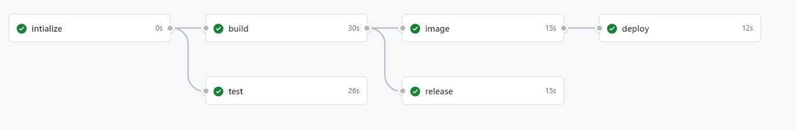

# CI-CD Pipeline

* [**Real world applications of GitHub Actions**](#real-world-applications-of-github-actions)
* [**Building a complete CI-CD pipeline for a sample Java-based application**](#building-a-complete-ci-cd-pipeline-for-a-sample-java-based-application)
* [**Building a complete CI-CD pipeline for a sample Java-based application Using Custom Action**](#building-a-complete-ci-cd-pipeline-for-a-sample-java-based-application-using-custom-action)
* [**Building a complete CI-CD pipeline for a sample Java-based application Using Custom Action from Marketplace**](#building-a-complete-ci-cd-pipeline-for-a-sample-java-based-application-using-custom-action-from-marketplace)

## **Real world applications of GitHub Actions**

GitHub Actions can be incredibly useful for automating various tasks in software development workflows. For TodoAPI application, here are some real-world applications:

* **Continuous Integration (CI):** Automatically run tests whenever changes are pushed to the repository. This ensures that new code doesn't break existing functionality.

* **Code Quality Checks:** Automatically check code formatting, run static code analysis, and enforce coding standards using tools like SonarQube or Checkstyle.

* **Automated Deployment:** Automatically deploy your application to staging or production environments after successful builds, ensuring that the latest changes are always available.

* **Issue and Pull Request Management:** Automatically assign labels, notify team members, or perform other actions based on the creation or modification of issues or pull requests.

* **Scheduled Tasks:** Schedule periodic tasks such as database backups, data synchronization, or generating reports.

* **Dependency Updates:** Automatically monitor for updates to project dependencies and create pull requests to update them.

## **Building a complete CI-CD pipeline for a sample Java-based application**

This job is responsible for building a continuous integration and continuous deployment pipeline for a Java-based application. It consists of the following steps:

- **Initialize:** Initializes the project and sets the Java version based on user input.
- **Build:** Checks out the repository, sets up Java, and builds the Maven project.
- **Test:** Checks out the repository, sets up Java, and runs Maven tests.
- **Release:** Checks out the repository, downloads the built artifact, creates a GitHub release, and uploads the release asset.
- **Image:** Checks out the repository, downloads the built artifact, builds a Docker image, and pushes it to Docker Hub.
- **Deploy:** Runs on a self-hosted runner, deploys the Docker image to Kubernetes.



```yaml
name: 27-01-CI/CD Pipeline

on:
  workflow_dispatch:
    inputs:
      java-version:
        type: choice
        options:
          - 11
          - 14
          - 17

jobs:
  intialize:
    runs-on: ubuntu-latest
    outputs:
      java-version: ${{ steps.set-java-version.outputs.java-version }}
    steps:
      - name: Intialize project
        id: set-java-version
        run: echo "::set-output name=java-version::${{ github.event.inputs.java-version }}"

  build:
    runs-on: ubuntu-latest
    needs: intialize
    steps:
    - name: Checkout repository
      uses: actions/checkout@v4

    - name: Setup Java 
      uses: actions/setup-java@v4
      with:
        distribution: 'adopt'
        java-version: ${{ needs.intialize.outputs.java-version }}
        cache: 'maven'

    - name: Build with Maven
      run: mvn clean install -Dmaven.test.skip=true

    - name: Upload jar to folder
      uses: actions/upload-artifact@v4
      with:
        name: my-artifact
        path: target/

  test:
    runs-on: ubuntu-latest
    needs: intialize
    steps:
    - name: Checkout repository
      uses: actions/checkout@v4

    - name: Setup Java 
      uses: actions/setup-java@v4
      with:
        distribution: 'adopt'
        java-version: ${{ needs.intialize.outputs.java-version }}
        cache: 'maven'
    - name: Test with Maven
      run: mvn -B test

  release:
    runs-on: ubuntu-latest
    needs: build
    steps: 
      - name: Checkout repository
        uses: actions/checkout@v4
      
      - name: Download web-app content
        uses: actions/download-artifact@v4
        with:
          name: my-artifact
          path: target/
  
      - name: Archive site content
        uses: thedoctor0/zip-release@master
        with:
          filename: site.zip
          
      - name: Create GitHub release
        id: create-new-release
        uses: actions/create-release@v1
        env:
          GITHUB_TOKEN: ${{ secrets.GITHUB_TOKEN }}
        with:
          tag_name: ${{ github.run_number }}
          release_name: Release ${{ github.run_number }}
          
      - name: Upload release asset
        uses: actions/upload-release-asset@v1
        env:
          GITHUB_TOKEN: ${{ secrets.GITHUB_TOKEN }}
        with:
          upload_url: ${{ steps.create-new-release.outputs.upload_url }}
          asset_path: ./site.zip
          asset_name: site-v${{ github.run_number }}.zip
          asset_content_type: application/zip

  image:
    runs-on: ubuntu-latest
    needs: build
    steps:
      - name: Checkout repository
        uses: actions/checkout@v4

      - name: Download web-app content
        uses: actions/download-artifact@v4
        with:
          name: my-artifact
          path: target/

      - name: Build Docker image
        run: docker build -t username/todoapp .

      - name: Log in to Docker Hub
        run: echo "${{ secrets.DOCKER_PASSWORD }}" | docker login -u "${{ secrets.DOCKER_USERNAME }}" --password-stdin

      - name: Push image to Docker Hub
        run: docker push username/todoapp

  deploy:
    runs-on: self-hosted
    needs: image
    steps:
      - name: Checkout repository
        uses: actions/checkout@v4
      
      - name: Deploy to Kubernetes
        run: kubectl apply -f new-deployment.yaml
  
      - name: Display all deployment and services
        run: kubectl get all -o wide
```

This GitHub Actions workflow is designed to automate the Continuous Integration and Continuous Deployment (CI/CD) pipeline for a Java-based application. Let's break down each section:

**Workflow Setup**

- Name: 27-01-CI/CD Pipeline
- Triggers: Manual trigger using workflow_dispatch, which allows specifying the Java version.

**Jobs**

1. intialize:

    - Sets up the Java version specified by the user input.
    - Outputs the selected Java version for later steps to use.

2. build:

    - Checks out the repository.
    - Sets up Java with the selected version.
    - Builds the Maven project, skipping tests.
    - Uploads the resulting JAR artifact to the `target/` directory.

3. test:

    - Checks out the repository.
    - Sets up Java with the selected version.
    - Runs tests using Maven.

4. release:

    - Checks out the repository.
    - Downloads the JAR artifact from the `build` job.
    - Archives the site content into a ZIP file.
    - Creates a GitHub release using the release number as the tag name.
    - Uploads the ZIP file as a release asset.

5. image:

    - Checks out the repository.
    - Downloads the JAR artifact from the `build` job.
    - Builds a Docker image named `username/todoapp`.
    - Logs in to Docker Hub using provided credentials.
    - Pushes the Docker image to Docker Hub.

6. deploy:

    - Runs on a self-hosted runner.
    - Depends on the `image` job.
    - Checks out the repository.
    - Deploys the application to Kubernetes using `kubectl apply` with a specified YAML file.
    - Displays all deployments and services using `kubectl get all`.

> NOTE:
> Adding Environment Variables
>
> To add environment variables to this workflow, you can use GitHub Secrets, which allow you to securely store sensitive information.
>
> * Navigate to your GitHub repository.
> * Go to the "Settings" tab.
> * In the left sidebar, click on "Secrets".
> * Click on the "New repository secret" button.
> * Enter the name and value of your environment variable.
> * Click on "Add secret" to save it.
>
> In the provided workflow, environment variables are used for Docker Hub authentication. The `DOCKER_USERNAME` and `DOCKER_PASSWORD` secrets are used to log in to Docker Hub.

## **Building a complete CI-CD pipeline for a sample Java-based application Using Custom Action**

For Custom Action refer to this [link](../22-CustomActions/22-01-CustomActions-Composite/22-01-CustomAction.md)

```yaml
name: 22-02-CI/CD Pipeline - Using Custom Actions

on:
  workflow_dispatch:
    inputs:
      java-version:
        type: choice
        options:
          - 11
          - 14
          - 17

jobs:
  intialize:
    runs-on: ubuntu-latest
    outputs:
      java-version: ${{ steps.set-java-version.outputs.java-version }}
    steps:
      - name: Intialize project
        id: set-java-version
        run: echo "::set-output name=java-version::${{ github.event.inputs.java-version }}"

  build:
    runs-on: ubuntu-latest
    needs: intialize
    steps:
    
    - name: Checkout repository
      uses: actions/checkout@v4

    - name: ANZ Setup Java
      uses: ./.github/actions/composite-cache-deps
      with: 
        java-version: ${{ needs.intialize.outputs.java-version }}

    - name: Build with Maven
      run: mvn clean install -Dmaven.test.skip=true

    - name: Upload jar to folder
      uses: actions/upload-artifact@v4
      with:
        name: my-artifact
        path: target/

  test:
    runs-on: ubuntu-latest
    needs: intialize
    steps:
    - name: Checkout repository
      uses: actions/checkout@v4

    - name: ANZ Setup Java
      uses: ./.github/actions/composite-cache-deps
      with: 
        java-version: ${{ needs.intialize.outputs.java-version }}

    - name: Test with Maven
      run: mvn -B test

  release:
    runs-on: ubuntu-latest
    needs: build
    steps: 
      - name: Checkout repository
        uses: actions/checkout@v4
      
      - name: Download web-app content
        uses: actions/download-artifact@v4
        with:
          name: my-artifact
          path: target/
  
      - name: Archive site content
        uses: thedoctor0/zip-release@master
        with:
          filename: site.zip
          
      - name: Create GitHub release
        id: create-new-release
        uses: actions/create-release@v1
        env:
          GITHUB_TOKEN: ${{ secrets.GITHUB_TOKEN }}
        with:
          tag_name: ${{ github.run_number }}
          release_name: Release ${{ github.run_number }}
          
      - name: Upload release asset
        uses: actions/upload-release-asset@v1
        env:
          GITHUB_TOKEN: ${{ secrets.GITHUB_TOKEN }}
        with:
          upload_url: ${{ steps.create-new-release.outputs.upload_url }}
          asset_path: ./site.zip
          asset_name: site-v${{ github.run_number }}.zip
          asset_content_type: application/zip

  image:
    runs-on: ubuntu-latest
    needs: build
    steps:
      - name: Checkout repository
        uses: actions/checkout@v4

      - name: Download web-app content
        uses: actions/download-artifact@v4
        with:
          name: my-artifact
          path: target/

      - name: Build Docker image
        run: docker build -t username/todoapp .

      - name: Log in to Docker Hub
        run: echo "${{ secrets.DOCKER_PASSWORD }}" | docker login -u "${{ secrets.DOCKER_USERNAME }}" --password-stdin

      - name: Push image to Docker Hub
        run: docker push username/todoapp

  deploy:
    runs-on: self-hosted
    needs: image
    steps:
      - name: Checkout repository
        uses: actions/checkout@v4
      
      - name: Deploy to Kubernetes
        run: kubectl apply -f new-deployment.yaml
  
      - name: Display all deployment and services
        run: kubectl get all -o wide
```

**Workflow Setup**

-   Name: 22-02-CI/CD Pipeline - Using Custom Actions
-   Triggers: Manual trigger using `workflow_dispatch`, with an input for selecting the Java version.

**Jobs**

1.  intialize:

    -   Sets up the Java version specified by the user input.
    -   Outputs the selected Java version for later steps to use.
2.  build:

    -   Checks out the repository.
    -   Utilizes a custom action (`./.github/actions/composite-cache-deps`) for setting up Java with the specified version.
    -   Builds the Maven project, skipping tests.
    -   Uploads the resulting JAR artifact to the `target/` directory.
3.  test:

    -   Checks out the repository.
    -   Utilizes the same custom Java setup action.
    -   Runs tests using Maven.
4.  release:

    -   Checks out the repository.
    -   Downloads the JAR artifact from the `build` job.
    -   Archives the site content into a ZIP file.
    -   Creates a GitHub release using the release number as the tag name.
    -   Uploads the ZIP file as a release asset.
5.  image:

    -   Checks out the repository.
    -   Downloads the JAR artifact from the `build` job.
    -   Builds a Docker image named `username/todoapp`.
    -   Logs in to Docker Hub using provided credentials.
    -   Pushes the Docker image to Docker Hub.
6.  deploy:

    -   Runs on a self-hosted runner.
    -   Depends on the `image` job.
    -   Checks out the repository.
    -   Deploys the application to Kubernetes using `kubectl apply` with a specified YAML file.
    -   Displays all deployments and services using `kubectl get all`.

## **Building a complete CI-CD pipeline for a sample Java-based application Using Custom Action from Marketplace**

```yaml
name: 27-03-CI/CD Pipeline - From Marketplace 

on:
  workflow_dispatch:
    inputs:
      java-version:
        type: choice
        options:
          - 11
          - 14
          - 17

jobs:
  intialize:
    runs-on: ubuntu-latest
    outputs:
      java-version: ${{ steps.set-java-version.outputs.java-version }}
    steps:
      - name: Intialize project
        id: set-java-version
        run: echo "::set-output name=java-version::${{ github.event.inputs.java-version }}"

  build:
    runs-on: ubuntu-latest
    needs: intialize
    steps:
    
    - name: Checkout repository
      uses: actions/checkout@v4

    - name: ANZ Setup Java
      uses: github-owner/repo-name@tag
      with: 
        java-version: ${{ needs.intialize.outputs.java-version }}

    - name: Build with Maven
      run: mvn clean install -Dmaven.test.skip=true

    - name: Upload jar to folder
      uses: actions/upload-artifact@v4
      with:
        name: my-artifact
        path: target/

  test:
    runs-on: ubuntu-latest
    needs: intialize
    steps:
    - name: Checkout repository
      uses: actions/checkout@v4

    - name: ANZ Setup Java
      uses: github-owner/repo-name@tag
      with: 
        java-version: ${{ needs.intialize.outputs.java-version }}

    - name: Test with Maven
      run: mvn -B test

  release:
    runs-on: ubuntu-latest
    needs: build
    steps: 
      - name: Checkout repository
        uses: actions/checkout@v4
      
      - name: Download web-app content
        uses: actions/download-artifact@v4
        with:
          name: my-artifact
          path: target/
  
      - name: Archive site content
        uses: thedoctor0/zip-release@master
        with:
          filename: site.zip
          
      - name: Create GitHub release
        id: create-new-release
        uses: actions/create-release@v1
        env:
          GITHUB_TOKEN: ${{ secrets.GITHUB_TOKEN }}
        with:
          tag_name: ${{ github.run_number }}
          release_name: Release ${{ github.run_number }}
          
      - name: Upload release asset
        uses: actions/upload-release-asset@v1
        env:
          GITHUB_TOKEN: ${{ secrets.GITHUB_TOKEN }}
        with:
          upload_url: ${{ steps.create-new-release.outputs.upload_url }}
          asset_path: ./site.zip
          asset_name: site-v${{ github.run_number }}.zip
          asset_content_type: application/zip

  image:
    runs-on: ubuntu-latest
    needs: build
    steps:
      - name: Checkout repository
        uses: actions/checkout@v4

      - name: Download web-app content
        uses: actions/download-artifact@v4
        with:
          name: my-artifact
          path: target/

      - name: Build Docker image
        run: docker build -t username/todoapp .

      - name: Log in to Docker Hub
        run: echo "${{ secrets.DOCKER_PASSWORD }}" | docker login -u "${{ secrets.DOCKER_USERNAME }}" --password-stdin

      - name: Push image to Docker Hub
        run: docker push username/todoapp

  deploy:
    runs-on: self-hosted
    needs: image
    steps:
      - name: Checkout repository
        uses: actions/checkout@v4
      
      - name: Deploy to Kubernetes
        run: kubectl apply -f new-deployment.yaml
  
      - name: Display all deployment and services
        run: kubectl get all -o wide
```

**Workflow Setup**

-   Name: 27-03-CI/CD Pipeline - From Marketplace
-   Triggers: Manual trigger using `workflow_dispatch`, with an input for selecting the Java version.

**Jobs**

1.  intialize:

    -   Sets up the Java version specified by the user input.
    -   Outputs the selected Java version for later steps to use.
2.  build:

    -   Checks out the repository.
    -   Utilizes an action (`github-owner/repo-name@tag`) from the GitHub Marketplace for setting up Java with the specified version.
    -   Builds the Maven project, skipping tests.
    -   Uploads the resulting JAR artifact to the `target/` directory.
3.  test:

    -   Checks out the repository.
    -   Utilizes the same action for setting up Java.
    -   Runs tests using Maven.
4.  release:

    -   Checks out the repository.
    -   Downloads the JAR artifact from the `build` job.
    -   Archives the site content into a ZIP file.
    -   Utilizes actions from the GitHub Marketplace (`actions/create-release@v1` and `actions/upload-release-asset@v1`) for creating a GitHub release and uploading release assets.
5.  image:

    -   Checks out the repository.
    -   Downloads the JAR artifact from the `build` job.
    -   Builds a Docker image named `username/todoapp`.
    -   Logs in to Docker Hub using provided credentials.
    -   Pushes the Docker image to Docker Hub.
6.  deploy:

    -   Runs on a self-hosted runner.
    -   Depends on the `image` job.
    -   Checks out the repository.
    -   Deploys the application to Kubernetes using `kubectl apply` with a specified YAML file.
    -   Displays all deployments and services using `kubectl get all`.