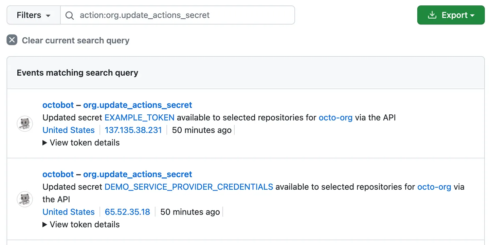
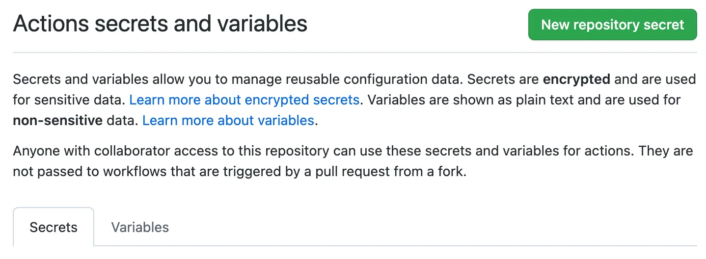
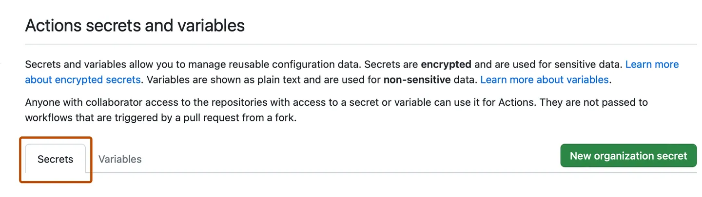

# Security and Governance

* [**Security best practices for GitHub Actions**](#security-best-practices-for-github-actions) 
* [**Security hardening for GitHub Actions**](#security-hardening-for-github-actions)
* [**Using secrets in GitHub Actions**](#using-secrets-in-github-actions)
* [**Automatic token authentication**](#automatic-token-authentication) 
* [**Auditing and monitoring GitHub Actions workflows**](#auditing-and-monitoring-github-actions-workflows)
* [**Governance and compliance considerations for using GitHub Actions**](#governance-and-compliance-considerations-for-using-github-actions)

## **Security Best Practices for GitHub Actions**

**Limit Access:** Only grant necessary permissions to GitHub Actions workflows, ensuring that only authorized users or services can access sensitive resources.

**Use Secrets:** Avoid hardcoding sensitive information like API keys or credentials directly into workflows. Instead, use GitHub Secrets to securely store and access sensitive data. Ensure that secrets are encrypted and never exposed in plain text.

**Audit and Monitor Workflows:** Regularly review and audit GitHub Actions workflows to identify any potential security vulnerabilities or misconfigurations. Use GitHub's audit log feature to track changes and monitor workflow activities.

**Implement Code Review:** Enforce code review practices to ensure that changes to GitHub Actions workflows are reviewed by team members before deployment. This helps identify and mitigate security risks early in the development process.

**Container Security:** If your workflows use Docker containers, ensure that container images are scanned for vulnerabilities before use. Use tools like Docker Security Scanning or third-party vulnerability scanners to identify and remediate security issues.

**Third-Party Actions:** Be cautious when using third-party actions from the GitHub Marketplace. Verify the reputation and integrity of the action provider, review the source code, and assess any potential security risks before incorporating third-party actions into your workflows.

**Security Policies:** Establish and enforce security policies and guidelines for GitHub Actions usage within your organization. Define guidelines for workflow design, secrets management, and access control to ensure consistent security practices across projects.

**Network Access Controls:** Limit network access for GitHub Actions workflows to prevent unauthorized communication with external services or resources. Use firewall rules, network policies, or VPNs to restrict outbound connections from workflows.

**Continuous Monitoring:** Implement continuous monitoring of GitHub Actions workflows to detect and respond to security incidents in real-time. Use security monitoring tools, log analysis, and anomaly detection to identify suspicious activities or unauthorized access.

**Stay Informed:** Stay informed about security updates, best practices, and new features related to GitHub Actions. Subscribe to security advisories, attend training sessions, and participate in community forums to stay up-to-date with the latest security developments.

## **Security hardening for GitHub Actions**

**Overview**

This guide outlines security hardening practices for GitHub Actions, focusing on mitigating risks associated with various features and potential attack vectors.

**1. Using Secrets**

Sensitive information should be stored as secrets rather than plaintext in workflow files. GitHub encrypts secrets client-side before storing them, minimizing the risk of accidental exposure. However, proactive steps are necessary to ensure proper handling of secrets:

* Avoid Structured Data: Do not use structured data formats like JSON or XML for secrets. Instead, create individual secrets for each sensitive value.
* Register All Secrets: Register any value derived from a secret as a new secret to ensure proper redaction in logs.
* Audit Secret Handling: Regularly audit how secrets are used to ensure they are handled securely.
* Minimize Scoped Credentials: Grant minimal permissions to credentials used in workflows and review their necessity regularly.
* Rotate Secrets: Periodically rotate secrets to minimize the window of vulnerability.

**2. Using CODEOWNERS to Monitor Changes**

Utilize the CODEOWNERS feature to control changes to workflow files, requiring approval from designated reviewers before modifications are made.

**3. Understanding the Risk of Script Injections**

Be aware of the risk of executing untrusted input, especially in workflows, custom actions, and composite actions. Potential attack vectors include injecting malicious scripts into workflow contexts.

**4. Good Practices for Mitigating Script Injection Attacks**

Mitigate the risk of script injection attacks by:

* Using Actions Instead of Inline Scripts: Prefer using JavaScript actions that process context values as arguments rather than generating shell scripts.
* Using Intermediate Environment Variables: Set context values to intermediate environment variables before using them in inline scripts.
* Using Starter Workflows for Code Scanning: Utilize starter workflows for code scanning to identify security vulnerabilities before deployment.
* Restricting Permissions for Tokens: Limit permissions for tokens to reduce the impact of exposure.

**5. Potential Impact of a Compromised Runner**

Understand the potential risks associated with a compromised runner, including unauthorized access to secrets, data exfiltration, and modification of repository contents.

**6. Considering Cross-Repository Access**

Exercise caution when accessing repository data across repositories, ensuring adherence to best practices and limiting access to sensitive resources.

**7. Hardening for GitHub-Hosted Runners**

GitHub-hosted runners employ measures to mitigate security risks, including reviewing the software bill of materials (SBOM) and denying access to certain hosts.

**8. Hardening for Self-Hosted Runners**

Implement security measures for self-hosted runners, considering factors such as the environment, access control, and management strategy.

**9. Authenticating to Your Cloud Provider**

Utilize OpenID Connect to create short-lived, well-scoped access tokens for workflow runs, enhancing security when deploying to cloud providers or managing secrets with HashiCorp Vault.

**10. Auditing GitHub Actions Events**

Utilize the security log to monitor user account activity and the audit log to track organization-level activity, ensuring visibility and accountability for actions performed within GitHub Actions.

For example, you can use the audit log to track the `org.update_actions_secret` event, which tracks changes to organization secrets.



## **Using secrets in GitHub Actions**

Secrets allow you to store sensitive information in your organization, repository, or repository environments.

**Naming your secrets**

The following rules apply to secret names:

* Names can only contain alphanumeric characters `([a-z], [A-Z], [0-9]) or underscores (_)`. Spaces are not allowed.
* Names must not start with the `GITHUB_ prefix`.
* Names must not start with a number.
* Names are case insensitive.
* Names must be unique at the level they are created at.

**Accessing your secrets**

To make a secret available to an action, you must set the secret as an input or environment variable in the workflow file. Review the action's README file to learn about which inputs and environment variables the action expects.

### **Creating secrets for a repository**

To create secrets or variables on GitHub for a personal account repository, you must be the repository owner. To create secrets or variables on GitHub for an organization repository, you must have admin access. Lastly, to create secrets or variables for a personal account repository or an organization repository through the REST API, you must have collaborator access.

* On GitHub.com, navigate to the main page of the repository.
* Under your repository name, click  Settings. If you cannot see the "Settings" tab, select the  dropdown menu, then click Settings.


* In the "Security" section of the sidebar, select  Secrets and variables, then click Actions.
* Click the Secrets tab.



* Click New repository secret.
* In the Name field, type a name for your secret.
* In the Secret field, enter the value for your secret.
* Click Add secret.

### **Creating secrets for an environment**

To create secrets or variables for an environment in a personal account repository, you must be the repository owner. To create secrets or variables for an environment in an organization repository, you must have `admin` access. For more information on environments, see "Using environments for deployment."

* On GitHub.com, navigate to the main page of the repository.
* Under your repository name, click  Settings. If you cannot see the "Settings" tab, select the  dropdown menu, then click Settings.


* In the left sidebar, click Environments.
* Click on the environment that you want to add a secret to.
* Under Environment secrets, click Add secret.
* Type a name for your secret in the Name input box.
* Enter the value for your secret.
* Click Add secret.

### **Creating secrets for an organization**

When creating a secret or variable in an organization, you can use a policy to limit access by repository. For example, you can grant access to all repositories, or limit access to only private repositories or a specified list of repositories.

Organization owners can create secrets or variables at the organization level.

* On GitHub.com, navigate to the main page of the organization.
* Under your organization name, click  Settings. If you cannot see the "Settings" tab, select the  dropdown menu, then click Settings.


* In the "Security" section of the sidebar, select  Secrets and variables, then click Actions.
* Click the Secrets tab.



* Click New organization secret.
* Type a name for your secret in the Name input box.
* Enter the Value for your secret.
* From the Repository access dropdown list, choose an access policy.
* Click Add secret.

### **Reviewing access to organization-level secrets**

You can check which access policies are being applied to a secret in your organization.

* On GitHub.com, navigate to the main page of the organization.
* Under your organization name, click  Settings. If you cannot see the "Settings" tab, select the  dropdown menu, then click Settings.


* In the "Security" section of the sidebar, select  Secrets and variables, then click Actions.
* The list of secrets includes any configured permissions and policies. For more details about the configured permissions for each secret, click Update.

### **Using secrets in a workflow**

To provide an action with a secret as an input or environment variable, you can use the secrets context to access secrets you've created in your repository.

```yaml
steps:
  - name: Hello world action
    with: # Set the secret as an input
      super_secret: ${{ secrets.SuperSecret }}
    env: # Or as an environment variable
      super_secret: ${{ secrets.SuperSecret }}
```

* Secrets cannot be directly referenced in if: conditionals. Instead, consider setting secrets as job-level environment variables, then referencing the environment variables to conditionally run steps in the job. 
* If a secret has not been set, the return value of an expression referencing the secret (such as ${{ secrets.SuperSecret }} in the example) will be an empty string.

### **Limits for secrets**

You can store up to 1,000 organization secrets, 100 repository secrets, and 100 environment secrets.

A workflow created in a repository can access the following number of secrets:

* All 100 repository secrets.
* If the repository is assigned access to more than 100 organization secrets, the workflow can only use the first 100 organization secrets (sorted alphabetically by secret name).
* All 100 environment secrets.

### **Storing large secrets**

**Encrypting the Secret File:**

**1. Encrypt the File:**

Run the following command in your terminal to encrypt the file containing your secret using GPG and the AES256 cipher algorithm:

```css
gpg --symmetric --cipher-algo AES256 my_secret.json
```

You'll be prompted to enter a passphrase. Remember this passphrase.

**2. Create a New Secret:**

Create a new secret in your GitHub repository with the passphrase you used in the previous step. For example, name the secret `LARGE_SECRET_PASSPHRASE` and set its value to the passphrase.

**3. Commit the Encrypted File:**

Copy the encrypted file (`my_secret.json.gpg`) to a path in your repository and commit it. Ensure you're committing the encrypted file ending with the .gpg file extension, not the unencrypted one.

```git
git add my_secret.json.gpg
git commit -m "Add new secret JSON file"
```

**Decrypting the Secret File:**

**1. Create a Decryption Script:**

Create a shell script in your repository to decrypt the secret file. For example, name the script `decrypt_secret.sh`. Here's an example of what the script might look like:

```sh
#!/bin/sh

# Decrypt the file
mkdir $HOME/secrets
# --batch to prevent interactive command
# --yes to assume "yes" for questions
gpg --quiet --batch --yes --decrypt --passphrase="$LARGE_SECRET_PASSPHRASE" \
--output $HOME/secrets/my_secret.json my_secret.json.gpg
```

**2. Make the Script Executable:**

Ensure your shell script is executable before checking it into your repository:

```sh
chmod +x decrypt_secret.sh
```
**3. Commit the Script:**

Add and commit the decryption script to your repository:

```git
git add decrypt_secret.sh
git commit -m "Add new decryption script"
```

**Using the Decrypted Secret in GitHub Actions:**

**1. Incorporate the Script in Workflow:**

In your GitHub Actions workflow file, use a step to call the shell script and decrypt the secret. Ensure you're referencing the script relative to the root of your repository:

```yaml
name: Workflows with large secrets

on: push

jobs:
  my-job:
    name: My Job
    runs-on: ubuntu-latest
    steps:
      - uses: actions/checkout@v4
      - name: Decrypt large secret
        run: ./decrypt_secret.sh
        env:
          LARGE_SECRET_PASSPHRASE: ${{ secrets.LARGE_SECRET_PASSPHRASE }}
      # This command is just an example to show your secret being printed
      # Ensure you remove any print statements of your secrets. GitHub does
      # not hide secrets that use this workaround.
      - name: Test printing your secret (Remove this step in production)
        run: cat $HOME/secrets/my_secret.json
```

**2. Remove Print Statements:**

Ensure to remove any print statements of your secrets in your workflow. GitHub doesn't hide secrets printed in logs, and it's crucial to keep them secure.

### **Storing Base64 binary blobs as secrets**

To store binary blobs as secrets in GitHub Actions using Base64 encoding, you can follow these steps:

**Encoding the Binary Blob:**

**1. Encode the Binary Blob:**

Use the base64 command to encode your binary file into a Base64 string. For example:

* On macOS:

```bash
base64 -i cert.der -o cert.base64
```

* On Linux:

```bash
base64 -w 0 cert.der > cert.base64
```

**2. Create a Secret:**

Create a secret in your GitHub repository containing the Base64 string generated in the previous step. For example, using the GitHub CLI:

```gh
gh secret set CERTIFICATE_BASE64 < cert.base64
```

**Decoding the Secret in a Workflow:**

**1. Access the Secret in Workflow:**

In your GitHub Actions workflow file, define a job to retrieve and decode the secret. Ensure you're referencing the secret correctly:

```yaml
name: Retrieve Base64 secret

on: push

jobs:
  decode-secret:
    runs-on: ubuntu-latest
    steps:
      - uses: actions/checkout@v4
      - name: Retrieve the secret and decode it to a file
        env:
          CERTIFICATE_BASE64: ${{ secrets.CERTIFICATE_BASE64 }}
        run: |
          echo $CERTIFICATE_BASE64 | base64 --decode > cert.der
      - name: Show certificate information
        run: |
          openssl x509 -in cert.der -inform DER -text -noout
```

## **Automatic token authentication** 

GitHub provides a token that you can use to authenticate on behalf of GitHub Actions.

**About the GITHUB_TOKEN secret**

The `GITHUB_TOKEN` secret is a special secret provided by GitHub that is automatically created at the start of each workflow job. Here's some key information about the GITHUB_TOKEN secret:

* **Automatic Generation:**GitHub automatically creates the `GITHUB_TOKEN` secret for each workflow job. You don't need to manually create or manage it.

* **Purpose:**You can use the `GITHUB_TOKEN` secret to authenticate within your workflow job. It serves as an authentication mechanism for accessing GitHub resources and performing actions within your repository.

* **GitHub App Installation Access Token:**The `GITHUB_TOKEN` secret is essentially an installation access token for the GitHub App installed on your repository. This token allows your workflow to authenticate on behalf of the GitHub App.

* **Limited Permissions:**The permissions of the `GITHUB_TOKEN` secret are restricted to the repository where the workflow is running. It cannot access resources outside of the repository.

* **Expiration:**The `GITHUB_TOKEN` expires automatically when a workflow job finishes or after a maximum duration of 24 hours.

* **Availability:**You can access the `GITHUB_TOKEN` secret within your workflow using the secrets.`GITHUB_TOKEN` syntax. Additionally, it is available in the github.token context.

**Using the GITHUB_TOKEN in a workflow**

To use the `GITHUB_TOKEN` in a workflow, you can reference it using the standard syntax for accessing secrets: `${{ secrets.GITHUB_TOKEN }}`. Here are some examples of how to use the GITHUB_TOKEN in different scenarios within your workflow:

**1. Example 1: Passing the GITHUB_TOKEN as an input to an action**

```yaml
name: Open new issue
on: workflow_dispatch

jobs:
  open-issue:
    runs-on: ubuntu-latest
    permissions:
      contents: read
      issues: write
    steps:
      - name: Open new issue using GitHub CLI
        run: |
          gh issue --repo ${{ github.repository }} \
            create --title "Issue title" --body "Issue body"
        env:
          GH_TOKEN: ${{ secrets.GITHUB_TOKEN }}
```

In this example, the workflow uses the GitHub CLI to open a new issue. The GITHUB_TOKEN is passed to the action as the value for the GH_TOKEN input parameter.

**2. Example 2: Calling the REST API**

```yaml
name: Create issue on commit

on:
  push:
    branches:
      - main

jobs:
  create_issue:
    runs-on: ubuntu-latest
    permissions:
      issues: write
    steps:
      - name: Create issue using REST API
        run: |
          curl --request POST \
          --url https://api.github.com/repos/${{ github.repository }}/issues \
          --header 'authorization: Bearer ${{ secrets.GITHUB_TOKEN }}' \
          --header 'content-type: application/json' \
          --data '{
            "title": "Automated issue for commit: ${{ github.sha }}",
            "body": "This issue was automatically created by the GitHub Action workflow **${{ github.workflow }}**. \n\n The commit hash was: _${{ github.sha }}_."
            }' \
          --fail
```

In this example, the workflow creates an issue using the GitHub REST API. The GITHUB_TOKEN is used as the authorization token in the API request headers.

> Notes:
> 
> * The `GITHUB_TOKEN` can be accessed through the `secrets.GITHUB_TOKEN` syntax.
> * Actions can access the `GITHUB_TOKEN` through the github.token context even without explicitly passing it.
> * When using the `GITHUB_TOKEN` for tasks, certain events triggered by it won't create new workflow runs to prevent recursive workflow runs.
> * Commits pushed by a workflow using the `GITHUB_TOKEN` don't trigger GitHub Pages builds.


## **Auditing and monitoring GitHub Actions workflows**

**1. Enable GitHub Actions Audit Logging**

* Activate audit logging within your enterprise’s GitHub instance.
* Capture all relevant events such as workflow runs, job executions, and secret accesses.

**2. Define Logging and Retention Policies**

* Specify what events and data should be logged.
* Determine the retention period based on compliance requirements and internal policies.

**3. Monitor Workflow Activity**

* Implement real-time monitoring solutions.
* Set up alerts for critical events like failed workflow runs, unauthorized access attempts, or excessive resource usage.

**4. Review Workflow Configurations and Secrets Usage**

* Regularly review the configurations to ensure compliance with policies and best practices.
* Monitor the usage of secrets within workflows and prevent inadvertent exposure.

**5. Perform Periodic Audits and Compliance Checks**

* Conduct audits to assess compliance with regulatory requirements and internal policies.
* Document findings and promptly remediate any identified issues or vulnerabilities.

## **Governance and compliance considerations for using GitHub Actions**

**1. Determine Allowed Actions:**

* **Internal vs. External Actions:** Decide whether to enable access to actions from outside the enterprise instance. Consider security and compliance implications.

* **Third-Party Actions**: Decide whether to allow third-party actions not created by GitHub. Options include:

  * Allowing actions from verified creators.
  * Limiting actions to a specific list.
  * Only allowing actions created by GitHub.

**2. Configure Actions at Various Levels:**

* **Repository Level:**

  * Manage GitHub Actions settings specific to each repository.
  * Configure allowed actions and permissions.

* **Organization Level:**

  * Disable or limit GitHub Actions for the entire organization if needed.
  * Define policies and restrictions for actions usage.

* **Enterprise Level:**

  * Enforce global policies and settings for GitHub Actions across the enterprise.
  * Ensure consistency and compliance across all repositories and organizations within the enterprise.

**3. Use OIDC with Reusable Workflows:**

* **Consistent Deployments:** Combine OIDC with reusable workflows to enforce consistent deployment practices.
* **Define Trust Conditions:** Set trust conditions on cloud roles based on reusable workflows to ensure secure deployments.

**4. Audit and Log Management:**

* **Audit Logs:** Regularly review audit logs related to GitHub Actions activity within the enterprise.
* **Retention Policies**: Determine retention policies for audit log data based on compliance requirements.
* **Export and Storage:** Plan for exporting and storing audit log data outside of GitHub if longer retention periods are necessary. Utilize log forwarding or streaming options for this purpose.

**5. Continuous Evaluation and Improvement:**

* **Regular Review:** Periodically review and update GitHub Actions governance policies based on evolving security requirements and compliance standards.
* **Feedback Mechanism:** Establish a feedback mechanism for developers to report any issues or concerns related to GitHub Actions usage.